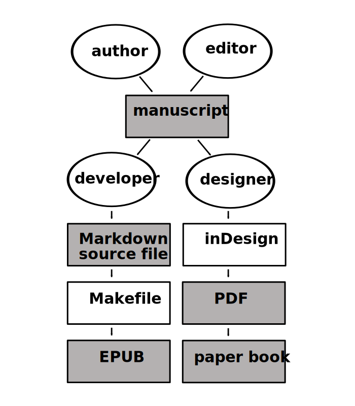

# Unite 

## Introduction
[The presentation given by Michael Murtaugh](http://networkcultures.org/digitalpublishing/2014/11/30/towards-a-hybrid-workflow-editor-designer-and-developer-unite/)during the Showcase of the Digital Publishing Toolkit resonated strongly with my experience of creating The Volkskrant Building ebook by Boukje Cnossen and Sebastian Olma &ndash; an overview of my experience developing the EPUB for that publication can be found in the [Digital Publishing Toolkit blog](http://networkcultures.org/digitalpublishing/2014/11/23/making-the-volkskrantbuilding-epub/). In that blog-post I half-heartedly criticized the top-down dynamic experience in the during this publication's development. 

My criticism goes not against each one of the actors involved in the publication production working areas they are best at. I certainly don't feel qualified to proof-read or create a visual identity for a publication. It goes against each actor developing his/her contribution in an island, permeated by sporadic contacts with the remaining actors taking part in the *collective* effort of publishing a book in more than one medium.

## Collaborative workflows
Such criticism begs the question: **how can publishing workflows change into collaborative environments, horizontal, flexible and inventive enough to resolve and profit from the challenges brought by hybrid publishing?** How can teams of authors, editors, developers and designers work collaboratively under one workflow instead of a series of parallel workflows?

**Resistance to change**
Miriam Rasch (editor of Institute of Network Cultures' publications, in which I have worked as a developer) makes a good point on a [blog-post](http://networkcultures.org/digitalpublishing/2014/10/28/how-to-handle-corrections-in-a-hybrid-workflow/) where she mentions her necessity as an editor to proof-read the publication's text in its designed form, which is easily understandable. A carefully designed publication encourages a focused reading experience that a computer screen or the printout of a MS Word document do not. For such reason it is a perhaps the best medium for proof-reading.  

## Resistance to change
In the same blog-post Miriam Rasch describes the implementation of corrections as being "usually marked by the editor and then issued to the designer, who will process them in the InDesign file, and to the developer who will do the same in the EPUB". Rasch argues that "it seems impossible to avoid multiple work on corrections, meaning both editor, designer, and developer might have to put them through in their respective files". In fact that's what has happened to all the hybrid publication so far, including the The Volkskrant Building.
Instead of calling it *a* workflow, I would risk describing it as a multiple workflows working in parallel to each other. 
The following figure attempts to present a visual representation of such dynamic.

In it, each of the actors involved in the production of the publication works on his/her stream, aiming for a specific output.
The streams don't intersect, and changes such as corrections, have to be implemented individually in each stream. 

### Critic of parallel workflows 
I disagree with Miriam Rash when she affirms that "it seems impossible to avoid multiple work on corrections".
And strongly believe that the parallel workflow(s) we have so far followed is not only inefficient and counterproductive, but can become a handicap to hybrid publishing, forcing publishers to exclude the possibility of publishing works in more that one format.

The difficulties of parallel workflow(s) become clear in previously described case of corrections implemented over multiple outputs. When the introduction of corrections is reiterated for each of the publications output, both chances for error and time spend on implementation drastically increase.

### Collaborative workflow
**How to work on a single, collaborative workflow?**

Contrary to what Miriam Rasch argues I believe that corrections do not need to be implemented in each of the book outputs.
Instead I expect a collaborative workflow, with Markdown source text files at is epicenter, to provide an adequate answer to the some challenges hybrid publications pose. The following figure presents a possible visual of such collaborative workflow.

In such workflow the Markdown source files are the building material from which all its outputs are generated. Git &ndash; distributed version control system &ndash;, is both the project's safety net and link between its various actors, keeping both track of changes, and syncing changes across author, editor, designer and developer.
Within this scheme all the actors involved in the workflow can intervene upon the source files, and be sure that their changes will be incorporated into the source files of all the other actors involved in workflow.
> The Markdown source files are at the origin of both EPUB and paper manifestations.

Like in the current INC's workflow for hybrid publications, the proposed collaborative workflow begins with author and editor working on the manuscript in .docx format. Besides the dialog between author and editor, the latter applies a [style guide](http://networkcultures.org/digitalpublishing/2014/10/21/style-guide-for-hybrid-publishing/) to the manuscript, which make for a seemingly conversion to Markdown. Once the manuscript is correctly formatted it is converted into a Markdown source file, and never used again.

The next stage revolves entirely around the Markdown source file. Here my proposal starts the diverge from INC's current workflow. Whereas in the current workflow Markdown source files are only of interest to the developer and at times the editor, in proposed collaborative workflow all actors work on the Markdown source file. They all contribute to its preparation for the next conversion. At this stage, among other actions, the colophon is introduced, footnotes are checked, figures placed, URLs are hyperlinked.

Once all this supplementary information has been added to the Markdown source file the collaborative workflow splits for each of its output. This separation does not mean these actors, become disconnected in their own production islands. Instead their interconnections are  maintained through the Markdown source file. To exemplify such interconnection take the case of last minute corrections. In this scenario the editor receives the draft design of the paper book. While reading she finds typos and elements that need to be altered. In collaborative workflow she can implement the necessary changes to the Markdown source file. Both designer and developer, being notified of such change, sync their Markdown source files to the editor's last version &ndash; a trivial process in Git tracked projects. The three now have their Markdown source file in its latest version, containing the editor's changes. What both designer and develop need to do id integrate those changes into the projects, destined to become an output for the publication. The EPUB developer can incorporate the introduced changes by producing a new EPUP version, via a Makefile, as described in [Making the VolkskrantBuilding.epub blog-post](http://networkcultures.org/digitalpublishing/2014/11/23/making-the-volkskrantbuilding-epub/). For the designer, changes can be incorporated into the inDesign project through the conversion of the Markdown source file into an ICML file. Importing an ICML file permits updating both content and structure, into an inDesign project, without affecting the project's design decision, as described by Silvio Lorusso in the [Markdown to Indesign with Pandoc (via ICML) blog-post](http://networkcultures.org/digitalpublishing/2014/10/08/markdown-to-indesign-with-pandoc-via-icml/).

> In both cases the work developed specifically for each of the outputs &ndash; either in CSS stylesheet and scripts or the inDesign/Scribus project &ndash; will easily incorporate the changes in the content.

### Advantages
The advantages of such collaborative and lean working methodology for hybrid publications seems clear.

It promotes an efficient workflow, that prevents a waste of time on replicating the same actions for each of the publication's output. And fosters a dynamic where editor, designer, developer and author work closer and interdependently.

If publishers do choose to work in hybrid-publishing under the same methods they have developed for with single-output processes, I am inclined to believe they wont be able to sustain the demands of such approach.

>All these actors directly involved in the creation of a (e)book must actively cooperate and share their expertise if they want the future of publishing to be a vibrant and innovative field. Innovation wont come from isolation, but from collaboration.

