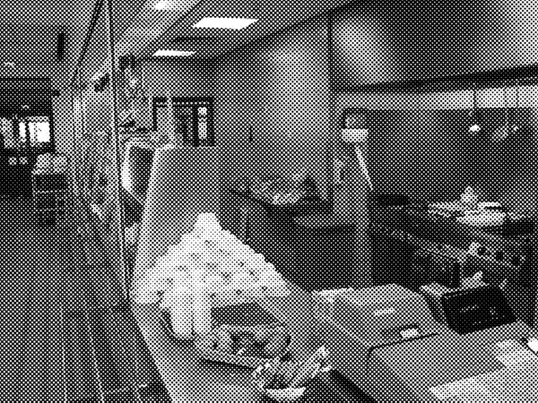

<!--
TODO: 
* Complete colophone
-->

# Contents

-   [Colophon](#colophon)
-   [Acknowledgements](#acknowledgements)
-   [Introduction: A Story of Transformation](#introduction-a-story-of-transformation)
    -   The Volkskrant Building and the Creative City
    -   The City from Below
    -   Creative Catch 22
-   [Origins: Spring 2007 and Before](#origins-spring-2007-and-before)
    -   Places of Collective Self-Recognition
    -   ‘Breeding Places’
    -   The Battle for the City
    -   'Grutters' and Alternative Economies
    -   From Attacking ‘The System’ to Protecting Subculture
    -   The Battle Continues
-   [Cash-Stripped Bohemia: 2007-2009](#cash-stripped-bohemia-2007-2009)
    -   Good Vibrations
    -   Mixing & Matching People
    -   Spending Cash
    -   The First Outbursts of Creativity
    -   The Flip Side of Openness
    -   Giving in to Security
    -   Onwards & Upwards
-   [Networks of Creative Production: 2009-2013](#networks-of-creative-production-2009-2013)
    -   No Formula for Success
    -   Canvas: Parties and a Great View
    -   The Business of Using Space
    -   DIY on the Fifth Floor
    -   Hyper-‘Grutters’
    -   Transformers
-   [Enter the Volkshotel – 2013 and Onwards](#enter-the-volkshotel-2013-and-onwards)
    -   Big Money
    -   Sounds of Protest
    -   Moving Out
    -   The Volkshotel and Its Legacy
-   [Conclusion: Failing Forward](#conclusion-failing-forward)
    -   The Tenants
    -   The City
    -   Urban Resort's Practices
    -   Performative Defiance
    -   Citizenship and Social Infrastructure
    -   Craftsmanship
    -   Virtuosity
    -   Conclusion
-   [Reference List](#reference-list)

# Colophon

**Boukje Cnossen and Sebastian Olma, The Volkskrant Building:
Manufacturing Difference in Amsterdam’s Creative City**

Production: Miriam Rasch

Design: UNDOG, Amsterdam

EPUB development: André Castro

Copy-editor: Margarita Osipian

Printer: [name]

Publisher: Amsterdam Creative Industries Publishing

Supported by: Amsterdam University of Applied Sciences (Hogeschool
van Amsterdam), Stichting Urban Resort, University of Amsterdam, Bureau
Broedplaatsen (Municipality of Amsterdam), Institute of Network
Cultures.

Cover image: A door of one of the studios in the art factory.
Picture by Tanja Sihvonen.

Contact:\
Amsterdam Creative Industries Publishing,
www.amsterdamcreativeindustries.com

EPUB and PDF editions of this publication are freely downloadable from
our website.

This publication is licensed under Creative Commons
Attribution-NonCommercial-ShareAlike 4.0 International (CC BY-NC-SA 4.0). 
To view a copy of this license, visit [creativecommons.org/licenses/by-nc-sa/4.0/](http://creativecommons.org/licenses/by-nc-sa/4.0/)
Amsterdam, November 2014

ISBN 978-94-92171-00-9 (print)

ISBN (EPUB)

# The Volkskrant Building: Manufacturing Difference in Amsterdam’s Creative City

The Volkskrant building more than any other place exemplifies
Amsterdam’s transformation into a ‘creative city’ over the past fifteen
years. Boukje Cnossen and Sebastian Olma trace the history of this
infamous and inspiring place from its deep roots in the squatting heyday
of the eighties to its present renaissance as the Volkshotel. The focus
of their entertaining yet rigorous analysis is the period from 2007 to
2014 when the Volkskrant building hosted an art factory (*broedplaats*)
run by the former squatters collective Urban Resort.

Artists, activists, city officials, entrepreneurs, and property
developers share their stories of the good times and the struggles in
and around the Volkskrant building. How did a group of former squatters
turn it into a place for both creative entrepreneurship and subversion?
And how could it happen that this countercultural project ended up
attracting the attention of one of the largest property investors in the
Netherlands?

This detailed inquiry into the practices and interests shaping the
epicenter of Amsterdam's creative scene provides a look behind the shiny
façade of creative city policy. The authors show how the Volkskrant
building came to be more than a space for creativity alone, as it opened
up the possibility for a new infrastructure of citizenship.

**Boukje Cnossen** is an academic researcher and art critic interested
in the organization and spatial politics of artistic production. She
holds a Master of Research in Humanities & Cultural Studies from the
London Consortium (Birkbeck College, University of London) and pursues a
PhD at the Faculty of Economics & Management of Tilburg University. Her
reviews, feature articles, and essays have appeared in various
publications, from Dutch dailies *NRC Handelsblad* and *Het Parool*, to
(art) magazines such as *De Gids* and *Metropolis M*.

**Sebastian Olma** is an author, researcher and critic working at the
interface between creativity and business. He was trained in Political
Science, Organization Studies and Cultural Philosophy in Leipzig, New
York and London. As director of Amsterdam’s Serendipity Lab he advises
governments and organizations on the creation and implementation of
policies around the creative economy. For the University of Amsterdam he
has built the Creative Industries Research Centre (CIRCA). He currently
is a senior research fellow at the Institute of Network Cultures.

# Acknowledgements

First and foremost we would like to thank Urban Resort for their support
in realizing this book. It was a great joy working with them. Our
special thanks go to the people of the Volkskrant building; all the
tenants but also those running Canvas and the Volkshotel. Without their
willingness to participate in our research, this book would have been
impossible. Bureau Broedplaatsen has kindly contributed to the
publication process and we are very grateful for this. We would also
like to thank the Faculty of the Humanities at the University of
Amsterdam, in particular CIRCA, for financing and facilitating the
majority of the research for this book. For the production and
publication of the book we are greatly indebted to the Amsterdam
University of Applied Sciences, in particular to Miriam Rasch of the
Institute of Network Cultures whose professional support, enthusiasm and
encouragement were absolutely vital for making this book happen. Thanks
to Margarita Osipian for proofing the text and to the Industries
Publishing division of the Amsterdam Creative Industries Network for
their brilliant support and speed in turning our manuscript into a
publication.

# Introduction: A Story of Transformation

This book tells the story of the Volkskrant building and how it became
an ‘art factory'. ‘Art factory’ is a slightly inspired translation of
the Dutch term *broedplaats* (literally: breeding place). It refers to a
subsidized space for creative production. In the case of the Volkskrant
building, however, the term art factory pretty much nailed it. In the
six years of its existence, the building hosted many, by now well-known,
manufacturers of art, such as the world-travelling DJ Tom Trago, the
internationally exhibited artist Wayne Horse, and the successful hip hop
label Killing Skills. It was also a place where some of Amsterdam's
greatest art and music festivals were produced, such as the Burning
Man-inspired Magneetfestival, performance festival De Parade, the Klik
Animation Festival, and hip hop festival Appelsap. But most importantly,
it was the place to be in Amsterdam for anyone who wanted to tune into
the beat of art and subculture.

As with all publicly subsidized art factories, the Volkskrant Building
was always meant to be a temporary creative space. In 2012, after 6
years of being an art factory, the building was sold for twenty million
euros, one third above its taxed value. Although this illustrates the
market value that creative city transformation is able to generate, the
story of the art factory does not end here. At the moment of writing,
the building has just been transformed into a hotel, retaining in its
name (‘Volkshotel’) a reminder of its former function. A smaller art
factory will continue to be part of the building and is effectively
subsidized by the hotel business. With this rather unique business
model, the aim is to keep the creative weirdness of the art factory.
Whether this is indeed going to happen is not a question we can answer.
However, we believe this development to be remarkable enough to document
the processes that changed this building from a practically worthless
office structure into a creative hotspot of serious interest to big
property developers. The analysis of these processes and their effects
are the subject of this book.

The Volkskrant building, perhaps more than any other place throughout
the city, exemplifies Amsterdam’s transformation into a ‘creative city’
over the past fifteen years. During the course of its recent career—from
a newspaper office to an art factory, and finally to an arty hotel—the
building was a nexus of the dreams, struggles and realities involved in
Amsterdam’s emergence as one of Europe’s most paradigmatic creative
cities. This, as many an observer has remarked, has less to do with the
city adopting those policies than it has with the city’s history as a
fiercely liberal and freethinking town.[^1]Amsterdam’s magnetic pull to
the rest of the world has always had a lot to do with it being a place
for radicals, outcasts and indeed, creatives. This started in the 17^th^
century, when Amsterdam was the economic center of the world, and
resurfaced in a completely different way in 1967 during what became
known as the Summer of Love. Some places are still trying to maintain
some of the city's characteristic craziness. The Volkskrant building
was—and hopefully will continue to be—one of them.

We provide a look behind the façade of the Volkskrant building, an
honest account of the conflicts and struggles, the parties and projects,
the transformation of dreams into reality. This account is intended as a
document of critical contemporary history and offers insights into the
workings of the creative economy.

## The Volkskrant Building and the Creative City

The transformation of the former newspaper office into an art factory
began in 2007. At this moment, the idea of the 'creative city' was
starting to become influential as a policy approach all over Europe. The
creative city paradigm emerged from the intersection of two different
developments. One was the political creation of the creative industries
as a new economic sector. Originally an initiative of Tony Blair’s New
Labor government, creative industries policies quickly started to spread
throughout the European continent. The goal of these policies was to
unify all those economic activities connected to the generation and
exploitation of intellectual property where, it was argued, the future
of economic growth was to be found and the prosperity of cities
ensured.[^2] The other development had to do with the idea of using
artists and creatives more actively within the processes of urban
planning and development. Popularized by academics like Richard Florida,
the 'creative class' became a crucial reference among city officials,
denoting a new breed of entrepreneurs and professionals which cities
needed to attract in order to remain competitive.[^3] In the imagination
of policy makers, artistic professionals and creative entrepreneurs
could become an engine of economic transformation and urban
regeneration. Yet, for this to happen, a new urban infrastructure was
required that catered to the needs of these creative producers.

In this context, the Volkskrant building's art factory seemed to provide
a perfect example of creative city transformation. As a ‘best-practice’
case, it was featured in presentations and publications of policy
experts, consultants, and academics in order to illustrate the
successful combination of artistic and entrepreneurial creativity. Just
as it happened with similar creative development projects, in the
Netherlands as well as internationally, the Volkskrant building was
often reduced to a couple of PowerPoint slides and a corresponding list
of 'success factors'. While such references are usually well-meaning,
they remain superficial. In fact, it is quite disturbing to see how
little professional interest there has been in the actual practices that
go on behind the funky façades of the creative city. We wonder: if one
wants to design policies catering to the needs of creative labor and
entrepreneurship, what could be more pressing than doing research into
the everyday realities of creative production?

If it is true, as the pundits do not tire to tell us, that we are in the
middle of massive social, economic, and cultural transformations, then
surely no one expects policy makers, pioneers, and first-movers to get
everything right the first time around. What we do expect, though, is a
rigorous analysis of policies and practices for the sake of their
improvement. Such rigorous analysis should start from a careful
observation of the day-to-day creative, strategic, and material
practices that, together, make up the creative industries, as they have
become known. Success or failure of the creative transformation of our
cities and economies depends for a large part on learning from one’s
mistakes. Right now, we do not see this happening enough.

Not being naïve, we do understand that there are a variety of reasons
for this omission. Critical research into economic practice has always
been a difficult endeavor, given the business interests at stake. The
idea of inter-city competition, which is at the heart of the creative
city paradigm, does not help to spread a critical ethos among public
institutions either. Always wary of one’s market value vis-à-vis
supposedly competing cities, officials prefer to work with docile
consultants and professional researchers who deliver a positive outlook.
At the same time, universities have a hard time adjusting their programs
to the interdisciplinary challenges that come with the new topologies of
creative labor and entrepreneurship. Increasingly commercialized funding
structures do not help this situation either. As a result, we see a lot
of infrastructural change in our cities but we are not able to properly
assess it.

With this book we would like to contribute to a much needed debate
around the creative city. Although we are aware that ours is a modest
effort, we hope to help deliver some empirical substance to an emerging
critical discussion. This discussion was articulated recently, for
instance, in an intervention by Roel Griffioen[^4], where the author
argues that many of the art factories placed in less vibrant areas are
essentially vehicles for a neoliberal version of social work, in which
the presence of artists and their projects must act as a cheaper form of
community work. Without denying or confirming this thesis, we open the
black box of the art factory in order to take a better look at the very
practices allegedly making up this neoliberal creative city. We also
believe that the case of the Volkskrant building has a significance that
goes beyond questions of the making of the creative city. Because the
Volkskrant building was about more than the generation of artistic and
economic value, it provided an infrastructure for experimentation with
more active and participatory forms of citizenship. We argue that, in
order to understand the full implication of the art factory, we must not
overlook the political dimension of those things happening within the
building.

## The City from Below

When politicians and policy makers talk about the importance of creative
spaces, they usually talk about things like entrepreneurship, technology
or city marketing. Whatever they refer to, their vision of the creative
city is always clean and sane. Artists and creatives are portrayed as
happy participants in their city’s economy, spending their days
canvassing business models, and feeding the market the latest
tech-experiences. But what they tend to forget is that the most radical
innovations do not come out of shiny offices but are forged on the
strange fringes of mainstream culture. This limited vision of creativity
is an omission in many European cities, but in Amsterdam it is an insult
to the city's history. It is no exaggeration to say that the
contemporary art and culture scenes owe a substantial part of their
existence to the past and—now illegal—present squatter scenes and their
adjacent networks.

Someone who understood this very well was the American geographer Edward
Soja, who visited Amsterdam in 1990. During his stay in the Dutch
capital, he carefully observed the legalized squats on the Spuistraat,
where he was living at the time. In the essay that resulted from these
observations, he states that the squatters movement was more than just
an occupation of abandoned offices, factories, warehouses, and some
residencies. ‘It was a fight for the rights to the city itself,
especially for the young and for the poor. Nowhere has this struggle
been more successful than in Amsterdam’.[^5] Looking at the narrow
stairwells and compact spaces of the houses so typical of Amsterdam's
city center, Soja noted that ‘the patient preservation yet modernization
of these monuments reflects that “original genius” of the Dutch to make
big things of little spaces, to literally produce an enriching and
communal urban spatiality through aggressive social intervention and
grass-roots planning, an adaptive feat on par with the Dutch conquest of
the sea’[^6]. For Soja, the legalized squatted communities that, in
1990, were all over the Amsterdam city, were indicative of a phenomenon
particular to Amsterdam. In order to better understand this, Soja picked
up on the British historian Simon Schama's notion of 'moral geography',
characterized as ‘an uncanny skill in working against the prevailing
tides and times to create places that reinforce collective
self-recognition and identity’.[^7] His main argument was that, in the
case of Amsterdam, the groups that could be called countercultural or
underground have in fact always collaborated with the existing powers in
order to create these places of self-recognition.

What Soja observed in the early 90s was the result of a long tradition
of alternative movements through which a practice of radical, yet
pragmatic, appropriation of space was established in the post-war
period. As we will see in the first chapter of this book, this is the
culture out of which the Volkskrant building emerged and this is also
the culture that forms the foundation of Amsterdam as a creative city.

## Creative Catch 22

The Volkskrant building was realized by a handful of ex-squatters who,
over the course of the project and with the support of the city, turned
into real estate developers. These squatters-turned-property-developers
infused this space that the city had handed over to them with the dose
of weirdness and mild insanity that—as we have said above—has always
been one of the reasons for Amsterdam’s attractiveness as a city. Taking
on the name Urban Resort, the ex-squatters built an organization that
was able to carry some of the old Amsterdam craziness into the future.

Since 2000, the Amsterdam city government has featured a department that
goes by the name *Bureau Broedplaatsen* [the Art Factory Bureau]. It has
been responsible for exploring the potential of vacant property for the
creative sector, as well as funding and facilitating the re-development
of appropriate buildings. Today, the Art Factory Bureau has contributed
to the realization of more than 3500 individual creative work spaces
divided over more than fifty locations throughout the city. Urban
Resort, the main character of this book, has had an ambiguous
relationship with the Art Factory Bureau. On the one hand, they wanted
to participate in the mainstream creative economy in order to show
everyone that they, quite literally, mean business. On the other hand,
they wanted to provide an alternative to that. This book explores this
tension in further detail.

The physical takeover of space, appropriating and shaping it according
to one’s own wishes, is something that Urban Resort had stimulated their
tenants to do from the very beginning. Coming from a squatting
background, one of their principles when setting up the art factory in
the Volkskrant building was self-management. Squatted communities or
other autonomous social spaces were, and still are, often run on the
basis of self-management. This means that democratic processes steer who
is responsible for what, which ultimately puts the collective at the top
of the organizational structure. And by running a space together, new
social ties can be formed. As one of the founders puts it: ‘You have to
allow people to adapt their space. If you paint a hallway together, you
will start to talk about other things than work’. In the case of the
Volkskrant building, Urban Resort's emphasis on self-management also had
very practical reasons. As people would clean and take care of
maintenance issues as a collective, rent could be kept low. However, as
we will see over the course of the book, many of these initial ideas had
to be altered according to the demands of today’s creative
professionals.

Setting up creative spaces, formerly done by squatters, has now become
serious business for more mainstream property developers as well. This
begs the question: if it does not happen at the borders of legality, but
rather out in the open, with commercial interests and instigated with
public money, does it work? And if so, how? Before we delve into the
detailed descriptions of the events of the Volkskrant building and the
historical background of stakeholders involved, we want to emphasize the
fact that the practices that came to shape the art factory often
contradicted the policies allowing their existence. These often
unresolved and perhaps unresolvable tensions formed a sort of political
background for the day-to-day operations of the art factory. Even if
they went unnoticed by many of the tenants, they determined, to a large
extent, the course of life of the Volkskrant building. We will return to
this question in our concluding chapter, where we turn to a more
theoretical reflection on our research material regarding the relation
between urban infrastructure and citizenship, drawing on the work of
Richard Sennett, Peter Sloterdijk and Paolo Virno.

Most of the research for this book took place between July 2012 and May
2013. The material we used consists of field notes from intensive
participant observation on a four-day-per-week basis, more than sixty
semi-structured interviews with tenants, extensive interviews with the
staff and management of Urban Resort, and several focus groups. This was
supplemented with archival material, as well as material from
conversations with policy-makers, property developers, relevant cultural
entrepreneurs, and other stakeholders who have provided the context in
which the building's communities took shape.

Doing research during the transitional period in which the building went
from being a subsidized art factory to becoming a commercial
art-flavored hotel has helped us understand the dynamics between those
to whom the building is an investment, those to whom it is a political
tool, and those who 'simply' go there to work. It has led us to conclude
that, although the differences in interest are evident and relevant, the
common denominator between these parties is that eventually, everyone
wants the place to be interesting. And as we will see over the course of
this book, it is precisely in deciphering the meaning of the adjective
'interesting' that we find clues about the value of places like the
Volkskrant building.

# Origins: Spring 2007 and Before

Figure 2. One of the remaining squats in the
Spuistraat, situated in the city center of Amsterdam.

The story of the Volkskrant building, as we will tell it, started in
March 2007. One afternoon, a small group of squatters gathered in front
of an office building east of Amsterdam’s city center on the windy and
traffic-packed Wibautstraat. Saying that they were out of practice would
be an understatement. Although some of them still lived in squats, the
times of breaking into buildings and occupying them were long gone.
However, they still cared about the vitality of the city. Otherwise why
would they be here, considering to 'do something', no one knew exactly
what, with the boring office building in front of them? Among them was
Jaap Draaisma, who remembered the feeling of the squatting days; that
they were changing not just their city, but the entire world along with
it. ‘It was crisis everywhere. In some countries, for instance Chile and
Portugal, communist systems were installed democratically. It was
possible to think that revolution was really about to happen’.

Now the talk of revolution had ceased for good. The tables had turned
and now the city government informed the squatters that this building
was empty. How the former opponents ended up working together so closely
is an interesting story. What's more is that it plays a big role in what
the Volkskrant building would later become: an odd mixture of urban
counterculture, the government's successful attempt at taming it, and
property investors eventually benefiting from the results. But before it
gets to that point, we should understand how rebellious squatters
started to rub shoulders with officials long before that moment in March
2007 on the Wibautstraat.

## Places of Collective Self-Recognition

In his essay observing the legalized squats on the Spuistraat in
Amsterdam, the American geographer Edward Soja argued that, in
Amsterdam, countercultural groups had always collaborated with the
existing powers in order to create and maintain their 'places of
self-recognition'.[^8] Vice versa, the city government at a certain
point had started to notice the value of the movements that challenged
them, and decided to organize those disruptive powers in order to
mobilize them for the sake of the entire city. Soja's observations will
be helpful to the reader who is not familiar with the complex dialectic,
that is particular to Amsterdam, between the former squatters and the
city government. It is against this backdrop that the development of the
Volkskrant building has to be understood. Let's take yet another look at
those former squatters as they are standing in front of the Volkskrant
building in the afternoon of March 2007. Hein de Haan, for instance, is
an associate professor in urban planning. Hay Schoolmeesters worked as a
cultural organizer on the NDSM-wharf, one of the city's formerly
industrial wharfs, and Eric Duivenvoorden has published various books on
the history of the squatters movement.[^9] Jaap Draaisma works as a
civil servant for one of the city's boroughs. But while all of them are
holding so-called 'decent jobs', each of them has nonetheless continued
to fight for the legalization and protection of squatted places. Only
they have resorted to more legal, and less tiresome, ways.

So will they be up for converting such a big building into a place for a
creative community? Time, it seems, is on their side. Amsterdam’s
officials are finally listening to them. Since the 90s, the economy has
been booming and Amsterdam chose to redevelop its waterfront into a
prestigious skyline. This meant getting rid of the remaining squats that
had settled in the old warehouses around the harbor. The tight network
that remained from the squatters movement, and of which our protagonists
are a part, protested against this, but to no avail. Now, as a way of
making it up to them, the city government is giving them a chance to
show what they were capable of.

## ‘Breeding Places’

The city has asked them to set up a so-called *broedplaats,* a term
idiosyncratic to the Amsterdam context at that time. A *broedplaats* is
something in between an incubator and an artistic residency. It
literally translates as 'breeding place' but the Amsterdam city
government uses the term 'art factory' in their English documents. This
policy, so the squatters were thinking, would enable them not only to
set up an autonomous community without the risk of being evicted, but it
would give them funding from the city on top of that.

So as they find themselves contemplating the rather boring looking
building that would soon be vacant, their hands are definitely itching.
It is a chance to prove what they are capable of. To contribute to the
city's diversity by making room for artistic experiments, cultural
exchanges, and countercultural manifestations. A space devoid of the
dominant economic rationale, where social and cultural values are more
important than financial gain. If only they knew what they signed up
for.

Hay Schoolmeesters had his doubts. Being the rookie of the gang, Hay
recalls planning for a year-long sabbatical when Draaisma asked him to
join him in setting up the Volkskrant building. ‘I looked up at the
Volkskrant building. The newspaper *De Volkskrant* still had to move
out, so we could only see it from the outside. I remember thinking: it
is too big, too ugly and too... office-like. We had experience with
warehouses, enormous empty halls where you simply draw lines on the
floor in order to determine who gets what space. No lifts, no
complicated heating or ventilation system, and especially no carpets and
no having to make a fuss about half a square meter’, says Hay.

The others agreed that the building was far from ideal, but had good
reasons to be tempted. ‘The aim was to use this building in order to
prove to Amsterdam that it was still possible to establish interesting
social and cultural communities based on a lot of freedom and with a
solid exposure to the neighborhood and the city. The Volkskrant building
would serve as a starting point. From there we would extend our practice
all over the city’, Hay recalls. Although this is, in a way, what
happened, none of them could foresee how difficult it would become. Over
the course of the next chapters we will learn all about it. Suffice to
say for now that, although these six squatters lack the legal and
managerial skill needed to run a place that is not a squat, their desire
to make it happen is unstoppable. In a sense, they still look at the
city the way squatters do: as a battle field.

## The Battle for the City

As in many other cities, the Amsterdam squatters movement emerged in the
70s out of the need for affordable housing. Although political and
ideological motivation would soon start to play a big role, squatting
did not start off as a political movement per se. The book
*Bewegingsleer* [Kinematics] is a rich and strange document of this
time, trying to provide a real-time account of the events as they
unravelled. The anonymous authors go to great length explaining that the
squatters movement was not a singular, well-defined movement, but
instead consisted of the convergence of several scenes, which were
concerned with different causes and directed different types of energy
towards these causes.

> Everyone defines the beginning and the end of “the squatters movement”
> differently. This is because everyone entered the common space in a
> different place. For some this happened by breaking the door into
> their own flat, for others it happened while drifting through the
> infinite voids of the urban complexes that were squatted with a large
> group. Every squatter can indicate the place where she or he crossed
> the threshold and entered a collective space.[^10]

Even though the initial motivations among squatters might have been
diffuse, it was through the practice of occupying space that a common
purpose emerged. The experience of being able to appropriate a little
piece of the city as an exercise in communal activism seemed to open a
window of some sort of opportunity into the future. In the words of the
authors of *Bewegingsleer*: ‘In the midst of the city, among the
concrete shapes of everyday *ennui*, one could enter a space of
unlimited possibilities’.[^11]

This shift from an almost accidental entrance into the movement, to the
realization that squatting enables you to do things differently, was
certainly what happened to Jaap Draaisma. He initially became a squatter
simply because he needed a place to live. After spending only a week in
a squatted building that was then evicted, Jaap ended up in another
squat and realized the political nature of the movement. Jaap: ‘They
were affiliated with Kabouter, real hippies. They created meditation
rooms in all these squats, with incense and what have you. There was a
lot of escapism to it, with their drugs and communes. I grew up in an
area that was rather poor and sympathetic to the communists because of
all the social work they did. Communists did not want to escape, they
wanted to take over. Coming from that background, I thought these
hippies were rather decadent’. The hippies Jaap refers to were
Amsterdam’s so-called Provos. At the end of the 1970s, their
manifestations, and the atmosphere of freedom and possibility that came
with it, attracted young people from all over the world to the city.
Perhaps in a peculiar way they could be seen as the alternative and
anti-commercial precursors of the later prophets of the gospel of the
creative class.[^12]

Despite his ideological fervor, the way Jaap finally became one of the
central figures of the squatters movement was quite pedestrian. It
started in 1975 when he was renting a room, legally, in the city center,
and received the message that he and his housemates had to vacate. Jaap:
‘Squatting was becoming more and more common at that point, and we
decided we could be tough too. So we put up a banner on the outside of
the property saying “We Are Staying”. All of a sudden, we had become
squatters. I started to negotiate on behalf of our group with the
landlord, and it turned out the city government owned the building. I
dealt with the press, got a grasp of how local politics work. I learned
a great deal from that’.

Squatting exploded at the end of the 1970s. ‘The movement went from
hundreds to thousands of people’, Jaap recalls. They quickly built up
their own universe within the city, as we learn again from
*Bewegingsleer*:

> Within the realm of squatting there was no sense of historical
> development, only the realization that one could find the same thing
> in an increasing number of places, including the weirdest corners of
> the city. Once you had entered you would be surprised to find so many
> more people in the same spot, as crazy, radical, and amateur as you
> were, surprised to see the cool pragmatism with which the most heated
> desire for action was executed. The space could literally be found in
> and outside of “the governing system”. “The city was ours”, because it
> was embedded within our own topology of secret signposts: buildings,
> cafes, haberdashers, vendors, cycling routes, streets and bridges,
> symbols, signals, posters, traditional clothing and hairstyles. The
> smell of damp leather jackets and shower-less houses, cat urine,
> plastic bags with car mirrors, stolen traffic signs […]. A spider web
> of backyards, staircases, coffee and booze drinking sessions, joints
> and trips, stencils, stolen books, press lists, breaking into TV
> stations, helmets and bats, breaking tiles, vans and carrier cycles
> [...].[^13]

The way this odd assemblage functioned was through so-called squatting
groups. Each of them was in charge of an area of the city and prepared
actions for that area, such as those during the coronation of the Dutch
Queen Beatrix in 1980. ‘In the month before we had squatted 120 houses
in Amsterdam’, Jaap recalls. Invoking violent encounters with the
police, this day showed that the city had truly become a battleground.

But the battle was about more than space. Jaap: ‘At the beginning of the
80s, the establishment was completely stuck. We were convinced that we
would take over the power. We did not know how, but we were absolutely
certain that it would happen. And there was proof that the world as we
knew it was collapsing. Amsterdam was practically a third world city.
Back then, at the beginning of the 1980s, nobody wanted to invest a
penny in the city’.

## 'Grutters' and Alternative Economies

Although squats represented a different vision of reality, it was still
not clear what that reality was supposed to look like. This changed when
some of the squats started to play a serious role in the city's cultural
life. Today, concert venues Melkweg and Paradiso, which were squatted in
the 1970s, are still bearing testimony to the cultural contributions
that have come from the squatters movement. Another major cultural venue
at the time was Wijers, which existed between 1981 and 1984.[^14] The
biggest squat ever running in the Netherlands was located close to
Amsterdam’s central railway station. It housed around a hundred small
companies, from galleries and studios to a concert hall fitting twelve
hundred people.

The experience of a place in which things were happening led the
squatters to believe they could create new economies. As such, squats
could benefit not just the people living there but the wider city too.
‘At Wijers, an alternative economy was emerging’, Jaap, who had started
to organize concerts there, recalled. ‘Around 200 people were able to
make a living from being part of our community. We were almost
self-sufficient. The chamber of commerce and local politicians took
interest in what we were doing. The economy we were creating had to be
one on our terms: with money, but without interest. With property, but
always collectively owned. We were following euro-communist thinkers
such as the current Italian president Napolitano, who believed that the
world could be taken over through gradual immersion into all
institutions, rather than through a violent revolution’.

The conviction that it was not just about squatting, but about setting
up culturally interesting communities, became the ideological basis for
the many legalizations of squats between 1981 and 1984. Many of these
were initiated by squatters themselves, Jaap being one of them. ‘We made
smart use of new policies aimed at creating social housing for young
people. This way we managed to legalize and renovate hundreds of squats,
so that the squatters who lived there became legal tenants’, he says.

The obvious advantage of legalization was that the alternative
communities were no longer threatened in their existence. But some of
the more radical strands within the squatters movement were against the
idea of business altogether, and therefore did not want to become
business owners themselves. Conflict and division arose within the
movement and in the more radical quarters. Jaap was seen as a sell-out.
‘All those squats wanted their own cafe, a stage, and an exhibition
space, but the radicals were against this because it meant you had to
deal with licenses and regulations. If you complied with those things,
you risked being taken for a petty shopkeeper, or a “grutter”, as the
Dutch slang of the time said’. [^15]

Wijers would become a sort of blueprint for the Volkskrant building.
Alderman Maarten van Poelgeest, in charge of urban planning in Amsterdam
between 2006 and 2014, already recognized the value the place had for
the city at the time. In an interview with Dutch daily newspaper *De
Volkskrant* he mentions Wijers as an inspiration for his later support
of art factories: ‘I had just come to Amsterdam to study. Wijers
represented the constructive part of the squatters movement, which
created new meanings for old property and did something worthwhile for
the city. It is a shame Wijers did not make it’.[^16] In a way, the
experience Van Poelgeest had visiting Wijers as a student led to him
supporting art factories in his political career.

While Wijers was proof that the squatters movement was not just about
protest but also about creation, its success was very much shaped by the
lack of opportunities the regular economy offered at the time. It
provided an infrastructure where people experienced an alternative
culture and economy that also gave them the opportunity for individual
and collective experimentation within changing societal conditions. ‘We
gradually had to let go of the idea of revolution, simply because
capitalism started to gain territory again. People wanted to live in the
city again, the market got back on its feet. By the end of the 80s I had
to conclude society wasn't as hermetic as I had thought and that we
could find spaces of opportunity within that system. It took some years
to get to that conclusion’, Jaap says. Over the course of this book, it
will become clear that the trajectory of the Volkskrant building cannot
simply be understood in terms of a relationship between two static
forces, the alternative scene on one side, and the mainstream on the
other, but that these two sides (to use simplified terms) continuously
shape each other as well. The alternative scene constantly had to
reinvent itself according to current political and economic
circumstances.

## From Attacking ‘The System’ to Protecting Subculture

To summarize, the Amsterdam squatters movement first fought for their
own places of self-recognition, to return to Soja's phrasing. Via the
‘grutter’-approach of setting up small alternative businesses and
cultural venues, they ended up living in a paradox of places that
claimed to be autonomous, yet needed the city's toleration to be
sustained. Instead of taking over the system, as they once intended, the
squatters had carved out their own zones within that system. Those
places not only provided inexpensive living space, but also helped
towards diversifying urban cultural life. Everything seemed to be smooth
sailing.

But it never hurts to look to one’s laurels. During the 1990s, as the
property market was reaching a peak, it was decided that almost all
alternative cultural venues around the harbor that had come out of the
squatting scene and had settled into warehouses, such as the Grampians
and Rieslings Amerika, had to disappear. A group of local politicians
and officials had been inspired by a field trip to cities such as
Baltimore and Boston in the United States,[^17] and felt that the shores
of the IJ, as the harbor’s water is called, had to become the city's
eye-catcher. The alderman responsible for this was Duco Stadig, a Dutch
Labor Party politician who was in charge of urban planning between 1994
and 2006. Jaap remembers not being amused with Stadig's plans:
‘According to him, all squats had to go. He did not see any added value
in them at all’. Duco Stadig himself has a more nuanced memory of that
time. ‘Some buildings could stay, others were demolished. We actually
renovated Pakhuis de Zwijger, which was squatted, with an enormous
amount of money. This would never have been possible now’.

The issue of the waterfront warehouses brought a more widespread
discontent with the ongoing gentrification of Amsterdam to the surface.
Duco Stadig felt he had to do something with that. ‘The city made a lot
of money by selling land for office locations, not just on the IJ-shore,
because companies were willing to pay a lot for that at the time’. In
1999, he convinced the city council to put 90 million guilders (45
million euros) aside. This budget would become the basis of the art
factory policy. This certainly started as a strategic move, because, in
Duco's own words: ‘Putting aside a lot of money gave me a good position
in the public debate. Although the squats at the IJ had to go, I could
say that we offered an alternative’.

But the former alderman was also convinced that what happens at the
fringes of a city can be of importance. Duco Stadig:

> In 1995 I visited an exhibition in a squat. I entered a very large
> room full of enormous art works. The person who was giving me the tour
> said that that was the studio of Peter Klashorst [a successful Dutch
> visual artist], who was about to leave because he was having his
> breakthrough. This is when I realized: it is really about those few
> instances that someone reaches the top from a broad foundation. You
> don't know who that will be, so you must nurture that entire
> foundation.

So the money was abundant and there was no lack of Florida-like good
intentions either. But the real discussion, about what to do with all
this money, still had to start. The city council founded a feedback
group with the title Project Group Art Factory, comprising of several
members from the squatters movement, among which were Urban
Resort-founders Hein de Haan and Hessel Dokkum. Throughout 2000, their
meetings took place at ADM, arguably the most outstanding squat in
Amsterdam and accidentally the place where another Urban Resort founder,
Hay Schoolmeesters, also lives. Jaap Schoufour, who would later become
head of the Art Factory Bureau, recalls the odd mixture of people.
‘There were two types of people in that group, really. Some said you
should never talk to the city government, because it is against the
essence of squatting. Others, for example the eventual initiators of
Urban Resort, wanted to be practical and discuss things with us’.

Out of this group emerged a plan with the title 'No Culture Without
Subculture'. It was presented to the city council on June 21, 2000 and
would become the basis of the art factory policy.[^18] The document was
full of pictures of artworks placed outdoors, artisans and craftsmen
working on tribal-looking objects, and communal areas of squat-like
places. The text also showed that the ideas for the policy were coming
straight out of the experience people had had in the (legalized) squats:

> These places have a role as the incubators of creativity for artists,
> craftsmen and cultural entrepreneurs. These places also supplement the
> facilities in the neighborhood (for instance by providing a dining
> facility, a community theatre, etc.). They are often characterized by
> large, tall spaces, with a low rent which offers an opportunity to
> those groups that cannot afford a workspace in the regular market.
> Such places serve a purpose for the city, for instance by
> strengthening the social infrastructure. These (living and) workspaces
> enlarge the quality, diversity and image of an area, they “produce”
> culture, which adds to the cultural richness of the city, they
> facilitate synergy between different cultural entrepreneurs and their
> environment, which will be strengthened even more if people live in
> these buildings as well, and the social climate of the area is
> improved by offering these facilities to the neighborhood.[^19]

The overall tone of the document is one of entitlement. If the city
government had taken away the underground cultural venues and was now
offering a consolation prize in return, then surely the people from
those evicted places should be first in line to receive it. It therefore
caused quite the shock when the newly installed art factory policy and
accompanying funds were not used to prevent the disappearance of the
already existing places that met the requirements of the new policy.

## The Battle Continues

Although beautiful plans and generous budgets were bringing officials
and squatters closer together, this was not the end of painful conflicts
between the city and the squatters scene. In fact, the most violent
encounter between police and squatters in a very long time was about to
take place. In October 2000, twelve adjacent squats known as the
Calendar Buildings were being evicted for the sake of expensive new
developments. This large complex full of artistic activity was situated
on a popular spot in the city center, just in front of Amsterdam's zoo.
So although the city had just promised to protect and fund alternative
cultural venues, the project developer had other plans.

Bas van de Geyn, who would later manage the Volkskrant building for
Urban Resort, was an active member of the community hosted by the
Calendar Buildings. Previously he had been involved in Berlin’s famous
*Wohnzimmerbar* movement in the late 90s:

> In Berlin, we would choose an area that had almost nothing going on
> and set up bars in living rooms. It is the type of thing that everyone
> knows Berlin for now, but at the time it was novel. We would just put
> on some music, have some discussions and people came. When I returned
> to Amsterdam, I thought the city was in desperate need of something
> similar. So I started to organize artistic evenings in the Calendar
> Buildings. We charged a small entrance fee and programmed between
> thirty and forty acts in one night, from punk bands to fine art
> exhibits, to independent documentaries. We were very ambitious.

It was at the Calendar Buildings that he met Jaap Draaisma, who was
running a martial arts center there. Jaap says the place reminded him of
Wijers. ‘There were concerts, an entire alternative economy could be
found there’. When it became apparent the new owner had a plan for the
large complex, Jaap ran into Duco Stadig again. Duco assured him there
was no other option than to evict the buildings. ‘It was not as if we
did not want to do anything for the creative underclass, to phrase it
that way, but we simply could not do anything there because the
buildings had been squatted after the redevelopment project had been
signed for’, says Duco.

While Jaap tried to convince the alderman in informal talks, other
squatters chose a more aggressive approach. ‘They blocked my front door
at some point. I woke up and could not get out of the house. I managed
to escape via the roof and had to call the city hall from my car to ask
them to fix it, since I had to rush to an appointment. They sent a
carpenter to take the multiplex away. On it, it was written: “We are
closing the door on you. The Calendar Buildings”’, Duco recalls, while
adding that the people responsible for this practical joke were not Jaap
and his friends.

Nevertheless, all squatters had difficulty understanding why the city
did not want to turn this complex into one of those new art factories
the city had promised to develop. So they decided to not leave easily.
Eventually about 500 people, probably all of what remained of the
Amsterdam squatters movement at that time, fought all night against the
police. Bas explains that their anger came from realizing that the
policy that was installed for the benefit of their scene, was now used
against them. Bas: ‘The city had prestigious studio buildings in mind,
and aimed at getting big names to rent studios, while the community of
the Calendar Buildings was doing exactly what the new art factory policy
had intended’. The eviction of the Calendar Buildings had only made the
alternative scene more aware of what they wanted to fight for. In
hindsight, the attempt to get the buildings legalized and funded through
the Art Factory Policy proved understandable, as a few squats, such as
OT301, would eventually go through such a procedure.

Given the increasing participation of the (former) squatters in the
debate around the art factory policy, a few evenings were organized in
Plantage Doklaan in 2004 and 2005. Plantage Doklaan is one of the
cultural squats that was legalized and therefore provided the perfect
backdrop for a discussion with the city government. The tone of these
meetings was a strategic one. The underlying question was how they could
get the city back for the subculture they represented. The organizers
called themselves De Vrije Ruimte [open space], and among them were the
eventual founders of Urban Resort: Hessel Dokkum, Eric Duivenvoorden,
Hay Schoolmeesters, Jaap Draaisma, Fred Stammeshaus and Hein de Haan.
When the organizers criticized the city's ongoing attempts to set up art
factories, alderman Duco Stadig challenged them to set up their own
space. During this evening, the idea of finding an empty building and
setting up an art factory on their own terms materialized. Shortly after
that, Urban Resort was established as a not-for-profit foundation.

The former squatters realized they had to find a building and Jaap
Schoufour, head of the Art Factory Bureau, suggested the Volkskrant
building. Negotiations with the owner of the building took up to six
months and the Art Factory Bureau played no part in this except for
looking at the rental contract. Jaap recalls they were very keen on the
city government not to be included in the Volkskrant building project.
‘The deal was to have the owner invest 400.000 euro into our project.
Later we came to find out that of this amount, 200.000 euro actually
came out of the Art Factory Policy’. At the time however, they were
unaware of this. Thinking the only investment came from the owner of the
building, Urban Resort decided to take on the challenge.

Over the course of spring 2007, they organized several brainstorm
sessions in which they came up with plans for the building. At this
time, they did not picture a building that would be dedicated solely to
the production of art. In fact, their ideas had much more to do with
enabling an alternative way of working, and setting up a community with
a certain atmosphere. Rooms for silence and meditation, a therapy
practice, a crèche, a technical workshop, kitchens, and even spots for
hammocks were on the list of possible uses. Judging from these ideas, it
is clear that they had no idea how sought-after every spot of the
building would become.

# Cash-Stripped Bohemia: 2007-2009

On the first of June 2007, the owner of the building, housing
corporation Het Oosten, handed over the keys of the building to Urban
Resort. Nothing had changed after De Volkskrant newspaper had left its
out-dated residence. Bas van de Geyn:

> When we entered the building, central heating had not been cut off and
> lights were still switched on. So we knew that at some point utility
> bills would start coming in. Although we did not have to pay rent for
> a few months, we needed to find enough tenants as quickly as possible,
> so that we could start charging rent after that, and cover our
> expenses. Luckily, the largest part of the building was made up of
> small office spaces, which was exactly what self-employed graphic
> designers, coders, copywriters and the like needed.

When Urban Resort took over, the building looked exactly as the
journalists had left it. ‘Everything was there’, Jaap Schoufour from the
Art Factory Bureau recalls.

> The mail boxes, tables, cables, kitchen equipment. The journalists had
> walked away with nothing more than their papers and PCs. So when Urban
> Resort entered the building they could use everything. The first
> tenants turned mailboxes into cupboards. The first floor had carpet
> because the board room of *De Volkskrant* had been there. This added
> some sort of glamorous element, which was hilarious. The famous
> *Volkskrant-*cartoonist Opland had worked on the fifth floor and he
> had drawn on the walls of his room. Of course, that was kept as it was
> too.

Most of the floors of the eight story building were already divided into
small offices, set up to be used by one or two people. This made the
building a perfect place for people who were looking to put a desk and a
computer in a room and start working without having to make too many
alterations. Although Urban Resort hoped that people would start making
the place their own, they soon realized the new generation was not as
keen on DIY as they were. ‘It is a bit of a culture shock to them.
Instead of liking the fact that they can change around their entire
floor, the creatives of the new generation think it is a bit of a
hassle. They want a floor which is completely ready’, Jaap Draaisma said
at the time, in an interview in Amsterdam-based newspaper *Het
Parool*.[^20]

Although the larger part of the building was practically ready to use,
there were some odd-sized parts as well. The second floor was where
Volkskrant editors wrote their copy. For the sake of quick communication
when deadlines were pressing, this area was one big open space of 1500
square meters. The third floor had about seven small darkrooms for press
photographs to be developed, which were way too many for even the most
dedicated artistic photographer with a preference for analog
photography. The basement could be the perfect place to build soundproof
recording studios, provided that yet-to-be-found tenants would be
willing to invest in constructing those. The top floor, finally, was the
newspaper's former company restaurant; a large space offering a majestic
view of the city. It was clear that this was the perfect spot for a bar
or club of some sort, if only the right license could be arranged.

But none of these practical issues could harm the feeling of excitement
that invaded the building as soon as the former squatters took over the
place in May of 2007. They had called in the help of Kaos Projects, a
group of self-styled anarchist organization experts, who would help out
in getting a community of tenants together. One of them was Julien
Haffmans. Julien was intrigued by the way in which Jaap and his fellow
ex-squatters used the term *vrijplaats*, which translates into English
as 'free place', to indicate an autonomous place in the city. Julien:
‘At that time, the word *vrijplaats* was used in a negative sense in
public discourse to indicate that a place was devoid of rules, full of
illegal activity. But free places are places where people can make their
own laws, which is a very positive thing’.

The news that there was such a new 'free place' in Amsterdam spread like
wildfire. In no time, six hundred people rushed to the empty Volkskrant
building, determined to get a workspace there. A first open night was
organized. Jaap Draaisma: ‘We had sent letters of invitation to the
squats and art schools in town, and because of our network and the long
waiting lists for studio spaces everywhere else, it did not surprise me
that so many people turned up. What did surprise me were the somewhat
more commercial types that were drawn to our initiative as well’.
Everyone signed up and eventually about two thousand names were on the
list for a space at the Volkskrant building. Wondering how to turn such
a large and diverse crowd into a reasonably well-composed group of
tenants, the former squatters turned to their own heritage. In their
squatting days, they had seen that self-managing communities rarely
exceeded thirty people. Julien: ‘We decided to translate this experience
into the present, and said that in order to rent an area or floor in the
Volkskrant building, you needed to be a group and you needed to have a
clear idea of what you want to achieve here with that group’.

## Good Vibrations

Throughout the summer of 2007, hundreds of strangers walked into the
building, with Urban Resort and Kaos Projects welcoming all of them.
Usually, people entered the building just to take a look, but the
building’s new hosts quickly got them to talk about their aspirations.
There was something about the attitude of the Volkskrant building’s new
hosts that made people share their dreams within a few minutes, Julien
recalls. ‘All we did was say: “Yes! That's exactly what we would like
you to do here!” As a result, people felt touched’.

It seemed as if Urban Resort and Kaos Projects had intuitively found a
way to transport the radical political attitude of the 80s squatters
culture into a contemporary DIY-approach in order to capture the
imagination of a diverse crowd of Amsterdammers. The art school students
and young creative entrepreneurs who showed up wanting to join the
project were, of course, far too young to recall the wild and free days
of a quarter century ago. Yet they understood that this emerging space
allowed you to do things that you could not do elsewhere. ‘People
entered the building and said: “I get this, I understand what’s going on
here”’, says Julien. ‘Keep in mind that the building still looked like
an abandoned newspaper office, and yet people got enthusiastic about it.
They would say: “wait, this is like in the 80s!” Or: “wait, this is
do-it-yourself!”’.

But from those first individual glimpses of recognition or inspiration
to a shared sense of purpose, it was still a long way. People could only
become tenants if they applied as a group. The idea behind this
requirement was simple: if a group of unrelated individuals would manage
to come together and decide on a name and some sort of goal, this could
set off a variety of self-management processes. Apart from the ideology,
there was a practical side to it as well. Julien: ‘Setting up the
building one tenant at a time would have been impossible. To begin with,
we simply could not remember a thousand names’.

Urban Resort and Kaos Projects were convinced this exercise in
self-management would lead to a situation in which these groups would
run the building. Jaap Draaisma: ‘We thought that certain managerial
tasks would be taken up by groups of tenants. We had no intention of
doing everything ourselves’. The people from Urban Resort had
experienced a high level of self-organization in squats and did not
think that paying a small amount of rent would get in the way of active
participation. Jaap: ‘In a squat you always pay for utilities, plus a
small amount for other general expenses. The way I saw it was that with
the Volkskrant building, we only increased the amount of money we needed
for those general expenses. I did not think it would make a big
difference’.

It must have been due to this belief in the self-organizing capacities
of their tenants that Urban Resort did not ask people to pay a deposit.
‘Granted, that was one of the stupidest things we did’, Jaap admits.
‘You might ask how we could have made that mistake with thirty years of
experience in setting up buildings under our belt’, he adds. Apparently,
the spirit of the 80s had survived, but its organizational form had to
be re-invented.

## Mixing & Matching People

Throughout the summer of 2007, so-called ‘dating nights’ were organized
in the Volkskrant with the aim to introduce interested individuals to
groups which were already applying to get a space. The first dating
night took place on June 1. A YouTube video of this evening shows Jaap,
Hay, and the other initiators of Urban Resort, alongside the people from
Kaos Projects, in front of a crowd of potential tenants.[^21] Standing
on a table in the largest room of the building, Jaap remarks that ‘Urban
Resort now has this building for the next six years’, which is followed
by cheers and applause. ‘Based on the idea of squatting and
self-management, and because we don't want to play landlord, we want
groups to rent an entire floor’, he continues. After that, already
existing groups presented themselves in order to attract more members, a
principle of self-organization. ‘They stood up on that same table and
started telling absolutely fantastic stories about what they were
capable of. I remember two women with polka-dotted umbrellas who put on
quite a show’, Julien remembers.

The spokeswoman of another group said they intended to build, on their
floor, a ‘multi-functional space in which to organize exhibitions, film
screenings, discussion nights, lectures, and courses’.[^22] She
continued that these would not be exclusively aimed at the Volkskrant
building, but also ‘open to the outside’. Many initiatives were not just
there to find a quiet space to work, but wanted to add something to
Amsterdam's cultural life as well. Those evenings were marked by the joy
of anticipation. ‘We would start around 8 pm, and after the
presentations from the group we would party with a DJ and cocktails. The
building was one big, buzzing beehive’, Jaap Draaisma remembers. After
groups were formed, they would go to great lengths to improve their
chances of getting their lease. Outside of these evenings, the emerging
groups were working hard to ensure a spot as well. Julien:

> We were in the building every day and the most determined people would
> come in every day as well. They would ask if they would get keys, or
> whether they could get the spot they had their eyes set on. There was
> definitely a competition going on between groups and we encouraged
> them to feel the affluence of possibilities, and tried to foster the
> growth of commitment to their own dreams.

After groups had been formed, the issue of dividing space appeared.
Julien:

> If we knew people would not be able to pay for one of the regular
> office spaces, we would take them to the sixth floor, which had
> odd-sized spaces, and say “just look what you could do with this!”.
> Most people wanted a space of their own but we asked whether they
> would be up for sharing a studio. Or we would take them up to the
> second floor, where the option of sharing a space was more feasible
> because the spaces still had to be created, and we would say: “look at
> that beautiful light coming from all sides through the windows!”.

Jelmer Rypkema, a landscape designer, was one of these people. He would
eventually rent his own workspace on the second floor but at first
wanted the second floor to stay one big open space. ‘I wanted to use it
as a shared studio space big enough for all sorts of equipment and
machines, with little corners for individual use. I will keep making
gardens, you know, but in the end, it is what I do to make rent. I
thought, what if I could do something with painting? For me it was about
the opportunity to develop myself’.

As the processes of finding spaces, and allies to share them with, took
the entire summer, some groups simply dispersed. Those with the stamina
to stay together over such a long period of time tried to get as much
space as they could. Julien:

> These groups were all saying they were bigger than they actually were.
> Instead of arguing with them, we were very affirmative and said: “yes,
> of course you'll make it happen”. At the same time, we had to get them
> to share their space with another group. So Jan Gieszen, my colleague,
> came up with the brilliant idea of saying that the building was
> elastic, that its walls would expand to accommodate all.

Erjee Vroling was part of a group that received such a message. Erjee is
a graphic designer who was so eager to get a place in the building for
him and his friends that he postponed his own graduation from art school
in order to work on the plan for his group. He remembers, quite vividly,
the method Kaos Projects applied. ‘They made us do some exercises, they
would ask us things like “what if you are all standing around a swimming
pool, would you dare jump in together”?. It was some weird stuff, but
all I was thinking was that I wanted a place in the building’.

While Kaos Projects believed that group dynamics would do their work,
and the community could take shape organically, it also became apparent
that the Volkskrant building project had to deal with some serious
practical problems that needed active management. One of those problems
was the fact that the floor plans of the building the previous owner had
provided were inapt. Urban Resort asked their friend Bas van de Geyn to
measure the surface of all floors. Bas, at the time a recent graduate in
social geography, started off with a mixture of enthusiasm and
amazement. ‘I did not know anything about property development’, he
recounts. ‘I really just started out with an ordinary tape measure,
because I did not even know that there was equipment for this. Tenants
had joined the Volkskrant building in that DIY atmosphere, so some had
measured their space themselves. I then had to arrange meetings and
measuring sessions with them to see if our numbers matched’.

Even with the difficulty of this task aside, his first impressions of
the overall Volkskrant building project were quite overwhelming. Bas:
‘There was this little office behind the reception that everyone from
Urban Resort and Kaos Projects worked at. That room was packed all the
time. There was an enormous vibe going on. I remember thinking,
“hopefully we'll manage to keep this going”’. It was the financial
precarity of the whole situation that was the largest threat. Bas: ‘One
week into the project I already saw that the whole thing could easily be
over in a few weeks' time’.

Practical issues did not keep tenants-to-be from starting to make use of
the building. In June 2007, the top floor was used for the rehearsal of
a theater performance by theatre group Opium voor het Volk [Opium for
the People]*.* The space used to be the staff restaurant of De
Volkskrant and would later turn into the popular spot Canvas. But at
this point, not many things had changed since the journalists had moved
out. ‘Even those small containers you keep the sandwich meats in were
still there’, one of the audience members recalled.

Nevertheless, many organizational issues were pending. The two main
issues were the lack of manpower on the side of Urban Resort and the
absence of even the most basic administrative system. In the early days,
Hay Schoolmeesters was often the only one from Urban Resort who was at
the Volkskrant building full time. ‘I worked all day in that small
office and rebuilt old filing systems of previous projects to create
some sort of administrative system. I did not go home. I slept at the
Volkskrant building in a sleeping bag. Every now and then, Jaap would
tell me to go and shower because we had an appointment at the city
hall’, Hay recalls.

The first rent would be due on the first day of November 2007, so the
pressure was on to have the building full of paying tenants by then. In
order to achieve this, all sorts of mundane yet crucial tasks had to be
ticked off the list. Urban Resort was given a huge box full of keys
without labels; each was supposed to give access to one of the work
spaces. Hay's partner, Caï van Hoboken, had a good eye for recognizing
keys' shapes and spent days matching key sets to doors. The group around
Erjee Vroling, who was introduced before as a participant in the
swimming pool exercise, moved into the fifth floor and started building
an entrance from the staircase to their hallway. The fourth floor was
taken by a group of artists who demolished one of the two toilet
sections in order to build their own kitchen. The second floor was still
an open space but, awaiting permission to build walls, people had
started to mark their own sections using laundry line and bunting. Those
tenants finally decided to divide the big open space into small studios.
Jelmer participated in this. ‘We built all those walls out of plaster in
a week. It was quite impressive to see how much we could achieve
together’, he says.

## Spending Cash

While the working spaces were coming together, there was an increasing
financial problem. In the beginning, Urban Resort aimed to charge 80% of
its studio spaces with the lowest possible rent. But this soon turned
out to be unfeasible. Furthermore, since the art factory had started off
without actual rental contracts, because the measurements of spaces were
still pending, some tenants took the liberty of not paying rent. Bas:
‘We had given everyone an estimation of what their rent was likely to
be, and asked them to set this sum aside on a monthly basis until we
would be able to charge the rent in retrospect. This worked remarkably
well for the majority of tenants, but there were exceptions’. One of
these was the third floor.

The third floor had formed a collective and a few people were
responsible for collecting and paying rent on behalf of everyone.
Fatuous Farah, one of the few tenants left from those days, recalls
their initial plans. ‘We had a general meeting every fortnight and some
budget for activities and expenses. But then people just refused to pay
rent. I think they did not realize they had to show commitment to the
group’. Jaap Draaisma: ‘Many of those tenants from the third floor were
being screwed over by the leaders of their collective. This caused them,
and us, great financial trouble. Finally, in the spring of 2008, we had
to decide to kick out those who did not pay’.

Outstanding bills remained an issue until 2010. Jaap Schoufour remembers
the many meetings he had in 2008 and 2009 with Urban Resort concerning
the financial troubles. ‘I was always astonished with the stories they
told me. Some people seemed convinced that they did not have to pay
rent. I really saw how hard Urban Resort worked. And they didn’t even
make any money from it either’. Jaap Draaisma, however, emphasizes the
fun that characterized the first and indeed challenging period of the
Volkskrant building art factory. ‘The first half year was fantastic.
Having so much space, all that opportunity, and parties everywhere
thrown by people who were starting up their studio’. Despite the
practical hiccups and hard work, there was a sense of excitement and
positivity on the side of Urban Resort.

What eventually saved the building from bankruptcy was a trick Hay came
up with. ‘We called it “operation carwash”’, he recounts. ‘We blocked
all key cards, so no one could access the building on their own. We set
up office in the entrance hall, simply by putting about seven tables out
there. Everyone who came in was screened to see if they had any
outstanding bills. If so, they had to pay immediately or else they were
denied entrance. Some of us stood up behind the tables, in case things
got violent. Eventually, the tenants who had paid joined us out of
curiosity’. Six of these ‘car washes’ happened; most of them during
office hours and some of them at night to catch those who had been
avoiding them.

## The First Outbursts of Creativity

And in spite of the continuing financial distress, the Volkskrant
building quickly became a place for intense creative production and
wacky celebrations of all things less mainstream. It had its official
opening as an art factory on September 21, 2007. The city council
originally did not grant the license for the party, but by the
intervention of the mayor the party was able to go on. In line with the
atmosphere of excitement, this fact was celebrated with a big party
throughout the entire building. In line with the policy of admitting
groups, rather than individuals, different networks started to settle
down and grow in and around the building. The first two years in the
life of the new creative hub were characterized by a very diverse set of
initiatives, all marked by a buzz of creativity and the feeling that
everyone was there to make the place into more than the sum of its
parts. Only a few days after the official opening, some tenants
seamlessly linked the fact that they were finally able to enter their
workspaces to the Soviet space program. ‘We are going into (our) space!
This calls for a challenge and a festive manifestation, Cosmic Party, to
celebrate the 40th anniversary of the Russian satellite Sputnik One
going into space’, read the invite of their party.

Furthermore the first so-called Volksevent was held in November 2007.
With generous funding from the Amsterdam Arts Fund, awarded with the
building barely up and running, Urban Resort was able to organize a
monthly event showcasing the work of their residents and offering a
platform for interaction and celebration. Each month, another floor was
responsible for hosting the event and the funding was used as an initial
catalyst, with the hope that each floor would subsequently start to
organize it themselves. In January 2008 it was the turn of
Volksspectrum, the community on the third floor which neglected paying
rent. In spite of these problems, they did organize an event with great
food, childcare, and percussion performances, showing that even though
some initial communities of the Volkskrant building fell apart, they did
have some fun in the meantime. The Volksevents were organized until
2009, the duration during which funding was available, but discontinued
due to a lack of commitment on the side of tenants, illustrating how
tricky it can be to create self-sustainable organizational processes
with no financial support.

In the same article, an art management professional tells them that the
building is ‘really good for people who come from outside the country
and haven't really got a network in Amsterdam yet’.[^23] Its
international appeal was indeed one of the strongest features of the
Volkskrant building art factory, especially in its first years. If a
city's success is indeed dependent on the input it gets from talented
and creative professionals, as is suggested by, for instance, the
sociologist Saskia Sassen,[^24] then the Volkskrant building provided a
strong and easy-to-handle tool for this. Many artists who came from
other countries described how easy it was to join the building, even
without becoming tenants, as long as they knew people who were looking
for someone to sublet their space to for a while, or share a studio
with. As such, the building acted as an informal and light-weight
residency program, given that the formal structures aimed at the same
objectives are often constrained by the restrictive hierarchies of the
contemporary art world.

Illustrative of the role of the Volkskrant building as an informal
residency program, or incubator space, is an article in the German
weekly magazine *Der Spiegel* featuring the Volkskrant building*.*
Volkskrant building resident Dorien Westphal states here: ‘I am a nomad.
If it's not buzzing any more where I live, I'll be gone fast’, Dorien
tells the reporter.[^25] Westphal, a product designer, has a 30 square
meter studio on the fourth floor of the building and gained worldwide
success, making handbags out of bicycle tires and inflatable mattresses,
through her contacts in Amsterdam. But Amsterdam's biggest appeal, she
tells *Der Spiegel*, has to be the Volkskrant building. ‘With almost a
hundred like-minded people, she is building a self-organizing
collective. This colorful group has taken over this building for seven
years. A painter piles up his work in the corridor, a wood artist drags
a sawing machine into his space’,[^26] describes the German magazine.

Even when the Volkskrant building was not the main topic, it got a lot
of attention from the press due to the fact that its tenants were doing
interesting things. In March 2008, daily newspaper *Het Parool* praised
the musical skills of Volkskrant building tenant and DJ Steven de Peven,
who would go on to organize many club evenings at Canvas, the club on
the top of floor of the building*.*[^27] One month later, hip hop act La
Melodia, who had only just settled into the building, was interviewed by
magazine *LiveXS.*[^28] Already in 2007, a group of artists from the
fourth floor set up the Klik Animation Festival. It started out slowly
but would eventually grow into an internationally recognized platform
for animation art.

Planet Art, a curatorial initiative that took residency on the ground
floor of the Volkskrant building, managed to attract a lot of attention
with their events and exhibitions. One of the first shows they curated
had an old fashioned gaming machine as its focal point, and they
followed this up with an exhibition with activist video art about
immigration and their very own punk art festival, Gogbot, among many
other things. But the most attention they received was without a doubt
when Tinkerbell, a young Dutch artist, exhibited at Planet Art in
October 2008. Made out of dead animals, her artworks caused quite the
stir. ‘Simonse's work is all about exposing the hypocrisy in people's
interaction with animals, particularly their domestic pets: kids treat
them like fashion accessories. Along with all the hate mail, her stunts
have also earned her guest spots on Dutch TV and a sizable share of
international press’, the Amsterdam branch of *Time Out Magazine*
wrote,[^29] while *Het Parool* reported that Planet Art expected ‘raging
animal activists’.[^30]

In December of that same year, another tenant of the Volkskrant building
made his claim to fame. Tom Trago had been an upcoming DJ for a few
years already, playing sets in many of Amsterdam's respected nightclubs.
He had been hesitating to record his own album because he was afraid to
give up his spots at Paradiso and Jimmy Woo, two renowned clubs in
Amsterdam, but also realized he needed to develop his own sound in order
to grow. Having his own studio at the Volkskrant building allowed Tom to
work on his music for a year straight. ‘I had to calm down a bit,
question myself and gain the confidence that I could do my own thing’,
he said about this period.

*Voyage Direct*, the album resulting from his period of secluded labor
won De Grote Prijs van Nederland [The Netherlands' Big Prize], a
prestigious national music award. It would not take long before he would
be booked to play sets all over the world, from Ibiza to the United
States. At the time of research for this book, in 2013, Tom Trago would
be traveling abroad at least twice a week and said that the reason he
was still based in Amsterdam was because it was ‘conveniently located
for world travel’. Although he certainly holds the credits to this
success, having an inexpensive studio space on a floor which he shared
with friends certainly helped.

Another success the building helped nurture is the artistic collective
Pips:lab. Although the group had existed eight years prior to the
opening of the art factory, the fact that some of its members had a
studio space in the Volkskrant building did help their collective
practices. In May of 2009, the collective hosted what *Het Parool*
described as 'a musical playground'[^31] in the, by then defunct,
headquarters of Dutch newspaper *Trouw*, conveniently located opposite
to the Volkskrant building. During this event, visitors were invited to
use installation works, creating rhythms or drawing with light. The
Volkskrant building was also at the intersection of events less
artistic, yet nevertheless very social. On December 13th, 2008 the
building hosted the ‘No Mercy Supply International Weed Cup’, a
marijuana contest. Among its jury members was hippy poet Simon
Vinkenoog, no stranger to some of the founding members of Urban Resort.
‘Just stay cool, high, and take time to fly!’, the flyer read
encouragingly.

It is this mixture of underground tendencies, with cutting-edge
experimental art, and commercially viable music, that best defined the
first two years of the Volkskrant building. Yet in spite of its
alternative characteristics, the Volkskrant building soon started to
appeal to a broad audience. A massive factor in this was Canvas, the
club and restaurant on the top floor, which would attract visitors from
as far as New York. We delve into the role the venue played in the
success of the Volkskrant building in more detail in the next chapter.

## The Flip Side of Openness

Looking back at the first two and a half years of the Volkskrant
building, we can conclude that in some respects, the building was indeed
a ‘free place’ of sorts. As a result, the place also attracted people
who had nowhere else to go. ‘Free zones attract damaged people’, Julien
says. ‘One of our rules was that we welcomed everyone. Well, I learned
that there is a lot of trauma amongst the people who are looking for
freedom’, she adds. In some cases it was hard to recognize the
difference between a high level of creativity and serious mental
illness. One of those cases was a young German man. Julien recalls
meeting him just like she met everyone in those days, by asking them
what they were dreaming of. ‘He was just very sensitive, poetic,
musically gifted, intelligent, but a bit lost. In hindsight I think he
was already psychotic then’, Julien recalls.

> Because he was homeless, we gave him a place on the sixth floor where
> he could stay. He was a musician, and an extremely talented one
> according to his friends. But during the first year it became clear he
> was not taking good care of himself. He did not eat well, abused
> drugs, and at a certain point he was just full on psychotic. I finally
> took him to my GP to get him medication, and we found his parents in
> Germany.

A second case she recalls was a homeless person who was friends with one
of the tenants who had been an active member of the Volkskrant building
community from the early stages. His case was different, because he was
not officially given a space, but stayed in the building for a couple of
weeks nevertheless. Julien:

> He came from Greece and had worked as a roadie, I believe. He had
> found himself a place in the basement where he could spend the night,
> but did not sleep at all. Instead, he was roller skating through the
> corridors of the building with a crown of LED-lights on his head. Or
> he went to the top floor, where Canvas had just started up, and
> started heating up chickens in their oven and cleaning up tables. He
> did strange, but fun, things. In a way he was also guarding the place.

Apart from not being a tenant officially, there did not seem to be a big
problem at first. ‘Well’, says Julien, ‘he had “friends” over in the
basement and at some point hard drugs were found in the space he used.
Urban Resort suspected he was dealing and kicked him out. A few weeks
later, we came to learn he had committed suicide. We felt a kind of
awkward responsibility there, since it turned out we had somehow taken
care of him collectively, but had not *really* taken care of him’.

## Giving in to Security

The openness that characterized the early days of the Volkskrant
building was not just an openness towards all kinds of people. It was
also a literal lack of closed doors, resulting in theft. Some offices
had all their computers stolen, and the Canvas coffee vending machine on
the ground floor was broken into a few times. Hella Masuger, one of the
first tenants and head of a foundation, had her office broken into as
well. ‘I don’t think it is a secure environment here’, she says in a
short video the Art Factory Bureau made about the matter.[^32] The large
scale and chaotic nature of the building were not the only explanations
for theft. Rents were kept as low as possible and this meant that hiring
security would lead to an increase in rent. Quite in the vein of the
overall project, the lack of security instigated several DIY initiatives
among tenants. The fifth floor, for instance, built a wall and door to
prevent entrance to their floor. Erjee Vroling: ‘Urban Resort kept
postponing that, so we did it ourselves. When they saw it, they said it
did not comply with regulations, but of course we didn't care’.

Obviously, the issue of theft is not exclusive to the Volkskrant
building. It points towards one of the paradoxes, that can be found more
often, of creative production in urban spaces. Creative production of
whatever kind cannot exist without a good degree of openness. The nature
of the modes of production happening in spaces such as the Volkskrant
building needs unexpected triggers in order to thrive, and one of these
is informal encounters between people. This is the reason why every
self-respecting operator of a creative hub, or co-working space,
mentions openness in their mission statement. But as soon as creative
production requires valuable equipment, things get a bit tricky. How
open can a building be before creatives have their gear stolen? While
security might be an unpleasant issue to deal with for people with a
rather libertarian predisposition; for ex-squatters it is a real pain.

After several severe instances of theft, Urban Resort had to come up
with a response. Pantar, an organization offering work experience to
unemployed people, was willing to offer their people as receptionists.
In addition, Urban Resort limited tenants’ access to their own floors
only. Although it made the place safer, it was not really helping the
openness and serendipitous nature of the building. Finally, theft also
led to a decrease in an atmosphere where tenants could still run into
each other. Fatuous Farah: ‘We had all our computers stolen. Somehow,
after those incidents, the trust was gone. People started to mind only
their own business’.

## Onwards & Upwards

In spite of its initial hiccups, the Volkskrant building remained a
place that attracted attention. So much so, that the city council
realized how much the art factory represented the creative image of
Amsterdam. Urban Resort received around a hundred requests over the
years from city hall to show around foreign groups of officials. ‘They
came from everywhere: Kazakhstan, Russia, Germany, you name it’, Jaap
remembers.

> They were invited, of course, because Amsterdam officials were loving
> the building too. It was a raw place, but also comfortable somehow,
> because they knew me and they knew the city supported it. Foreign
> groups would also run into people from their own country, which was,
> again, great for the international appeal of Amsterdam. Job Cohen,
> mayor of Amsterdam at the time, even celebrated his birthday at
> Canvas.

But the highlight must have been the time Jaap had to free a lift full
of civil servants at 3 am. ‘They had hired out Canvas for a function and
continued partying in the lift, I think’.

There seems to be an odd poetic justice to the fact that the same city
that had once evicted places such as Wijers was now actively subsidizing
a somewhat similar initiative.[^33] It was doing so both through the
official channels and by having their functions there. Jaap: ‘Indeed,
they embraced the very thing they wanted to rid themselves of. This
embrace also had to do with the fact that we were one of the first ones
offering a solution for all these vacant buildings. There was nothing
alternative about that, it was just smart’. But it was not until several
years of the art factory's first steps towards fame, that it would
become clear exactly how smart their choice for this building had been.

# Networks of Creative Production: 2009-2013

Urban Resort did their best to match the squatters' ethos of autonomy
with the wishes of the new creative class and to play by the rules and
regulations of the city council. Doing this meant to shift from looking
at things in terms of of 'what is best' to 'what works in which
context'. Although initiated by squatters, the Volkskrant building did
not become very squat-like. One of the most obvious reasons for this was
the fact that rent had to be charged. ‘The big difference between this
place and a squat is that when you squat, you don't have to pay rent.
And when you don't have to pay rent, you don't have to work. That means
you have a lot of time to set things up together, organize stuff’, as
one of the tenants put it. Jaap Schoufour, head of the Art Factory
Bureau, put it in the following words: ‘The start of the Volkskrant
building was way too ideological. Urban Resort copied their experiences
from the 80s into 2007’.

## No Formula for Success

Doreen Wittenbols, who works at Urban Resort's financial department, but
also used to live at the Plantage Doklaan, one of Amsterdam's legalized
squats, confirms the fundamental difference between living and working
in such a place, and working in an art factory*.* She thinks that the
basis on which a squat functions does not translate well into the
current context. ‘Much of the public funding for young artists has
disappeared now, and artists have never earned much to begin with. When
we talk about how we want them to contribute to the community of the
Volkskrant building I sometimes wonder: what can we expect from them? In
a squatted community people simply have more time to do things for the
collective, and it does not work that way here’, she says.

Hay Schoolmeesters acknowledges this:

> It took a long time before we realized that by asking rent from the
> people we provided with space, they would participate less as a
> result. In squatted communities, your participation is a necessity,
> because there are always things that need to be done in order to keep
> the building. Here in the Volkskrant building people think: “I pay
> rent, therefore I can expect some things in return”. We must be aware
> of that, and as an organization we should spend more time interacting
> with our tenants.

The only strategy for this, he thinks, is not giving up. ‘You have to
continue to organize meetings and parties. Who cares if no one shows up?
Next time they will. And if not, the time after that. That's the only
way to do it. Just continue to create a good atmosphere, and never give
up’. In spite of Hay’s and others’ good intentions, the self-managing
communities Urban Resort had envisioned did not take off in the way they
had hoped. All but two of the initial groups dissolved, in the sense
that they did not become self-organizing groups who paid rent on behalf
of the entire group, took on maintenance tasks, and organized events. On
top of that, the planned interaction across floors was constrained by
the fact that tenants could only access their own floor.

At the same time, many of the tenants of the dissolved groups did stay.
The original group Oostblok, artists who resided in the back wing of the
second floor, hosted activist initiatives against the regeneration plans
for the immediate area. Fashion journalist and performer Aynouk Tan
became a tenant in the building as part of a fashion collective. While
their collective plans did not take off, Aynouk built a name for herself
with a thought-provoking column in the quality newspaper *NRC
Handelsblad*. Having remained in the building throughout the years, she
argued for the importance of alternative places when she was interviewed
by Amsterdam’s local television station AT5.[^34] Such examples show
that even though the original setup with self-managing groups failed,
some of its alternative spirit continued to mark the building.

Looking at the period after the initial two year startup phase, it is
fairly obvious that the Volkskrant building became a relevant and
important place for the creative scene, as well as the young crowds of
the city. Although rent was increased several times due to all sorts of
unforeseen costs, people were still dying to get a place in the
building. Some even entered floors without permission, knocking on
studio doors to ask tenants for advice on how to get a studio space. So,
if self-management did not work out, what did? What made the Volkskrant
building successful in its own way, and what did this success look like?

Despite the claims of consultants, the desires of policymakers, and the
rhetoric of overenthusiastic trend watchers, there is no formula for a
successful creative hub, or, indeed, art factory. In fact, the very idea
of such a formula begs the question of what success should actually look
like. As discussed in the previous chapters, the art factory in the
Volkskrant building started to look very different from the spaces and
practices imagined by the people setting it up. Yet again, in this
process of trial and error, a lot of things happened and a lot of fun
was had. In this chapter, we delve into what we think are the key
ingredients that gave the Volkskrant its specific character: the venue
on the top floor; the fact that people could alter the spaces they used;
and the sociality that characterized the atmosphere of the building,
which sometimes led to interesting collaborations, although we argue
that this should not be seen as the central purpose of a place such as
the Volkskrant building. We will also show how each of these elements
cannot be seen as exclusively ‘bottom-up’ or ‘top-down’, to borrow again
from the ubiquitous lingo of creativity consultants. In order to
illustrate this, we will finish with an example of an annual festival
that was organized in the building. But we will start with Canvas,
undoubtedly one of the biggest contributors to the art factory's
success. So much so, that people were surprised to find out the building
was something else too.

## Canvas: Parties and a Great View

As was the case with many elements of the Volkskrant building, Canvas
was a result of chance combined with some initial good selection. Thijs
Timmers was barely out of art school long when he started looking for a
studio to paint, and ended up at the Volkskrant building. Initially part
of the group that took on the fifth floor, he soon came to learn that
Urban Resort was looking for an entrepreneur to turn the top floor, the
former staff restaurant, into a cafe of some sort. 'At that point I had
been making cocktails for festivals on the side for some time', Thijs
recalls, while being interviewed on the Canvas terrace. 'I think my plan
was chosen because my concept was based on the participation of other
tenants besides me'. Without a loan from the bank, and with very few
resources, he started out in the summer of 2007.

Canvas, as the name suggests, would be a space open for the exhibition
of artwork and the showcasing of musical talent. As the interior
consisted of rotating artworks, such as tables painted by artists, the
place would undergo a metamorphosis from time to time. Although a full
license was pending for the first six months after its unofficial
opening, Thijs did what he could to cater to the new residents of the
building. 'I would walk through the corridors of each floor with
trolleys in order to sell dinner to the new tenants. It was difficult
though, because many of the studios were still to be rented out'.

What did work well were the parties that were soon being thrown: fashion
events for emerging designers, a theme night centered around music from
a particular year, or a party dedicated to girls smoking cigars.
Sometimes party goers were invited to dress up in vintage clothes lent
to them by the creative duo Visjuweel. 'Our motivation is to see how
people, once in fancy dress, become much more liberated. In different
clothes, it seems people can let go completely', the duo said to *Het
Parool* in December 2008.[^35] Of course, Canvas benefited massively
from the DJs who were Thijs Timmers' friends. In the first few years,
Tom Trago, also part of the fifth floor network that introduced Thijs to
the building, would play his sets in exchange for free food and drink.
Artist Steven de Peven and party organizer Silvester Poll, both tenants
downstairs, would conceptualize and plan the themes and entertainment
for many nights. And of course, the place had solid assets such as great
cocktails and a fantastic roof top terrace.

Next to clubbing, Canvas' restaurant did not go unnoticed either,
although it seems not many people came for the food. The food critic of
*NRC Next* wrote in the fall of 2008 that Canvas was 'a spot to look at
other people' and that 'no people in suits had been spotted yet',[^36]
indicating that the underground vibe was one of its charms. However,
Canvas appeared to be not far enough off the beaten track for *The New
York Times* not to notice it. In April of 2009 the newspaper wrote that
'Canvas boasts one of the most spectacular and unimpeded views of
Amsterdam' and concluded that 'sitting outside with a coffee and a good
book is an inspiring way to spend an afternoon'.[^37]

With a small interruption in the spring of 2008, when the council closed
the club due to complaints from neighbors using the pending license as
leverage, Canvas had a straight and steep rise to stardom. 'On a Friday
we have about a hundred people for dinner and on a club night we have
around 400 guests', said Thijs Timmers by 2012. 'Those big numbers on a
club night immediately means that the percentage of tenants among our
guests probably does not exceed twenty percent', Thijs readily admitted.
From his initial plan to become some sort of living room with extras,
Canvas grew into one of the favorite spots for Amsterdammers and
visitors for a coffee or a beer with a great view over the city.

The latte-sipping crowds aside, Canvas did maintain its ties with
Amsterdam’s alternative heritage. Living Legends, an evening showcasing
the hippie stars from days gone by, was an initiative organized by
artist Steven de Peven. The plan emerged completely organically and
without Urban Resort’s interference. Nevertheless, Jaap Draaisma was
pleased and surprised in equal measure to see the alternative crowd that
was the precursor of the squatting movement of the 80s, pass by. 'All of
a sudden, hippie-artists such as Hans Plomp and Simon Vinkenoog were
performing their poetry at Canvas on a Friday night', he recalls. And
the Living Legends night was not the only tie to the old hippies and
Provos the Volkskrant building had. Willem de Ridder, Fluxus artist and
well known member of Amsterdam’s 1970s hippie scene, broadcast a radio
show from the Volkskrant building for a while. Urban Resort founder Eric
Duivenvoorden published a book on the legacy of Provo leader Robert
Jasper Grootveld, which was launched at Canvas, and when Robert passed
away in 2009, the after party of the funeral took place at the
Volkskrant building.

## The Business of Using Space

The seven remaining floors, together about 10,000 square meters of
usable surface, was comprised of the studios and offices of roughly
three hundred people from the cultural and creative sector, as well as
some non-profit organizations and the occasional accountant or
consultant. It was a second—and sometimes clandestine first—home to
painters, musicians, sound engineers, dance teachers, writers, internet
startups, graphic designers, project managers, computer coders,
communication experts, social enterprises, and filmmakers. On an average
day, one was likely to run into several dogs and get the occasional
breeze of marijuana in the hallways. The building was accessible for
tenants 24/7, making it perfect for after-parties in art studios on the
weekends. While you could notice at least an awareness of office hours
on most floors, the basement and fifth floor, mostly filled with
musicians and artists, were most productive at night.

Throughout the entire building, about a third of all workspaces had
their doors open.

During the first two years, the larger spaces had been used for events
and exhibitions, until Urban Resort needed extra income and started
renting them out as lecture halls. Tenants could still use these spaces
against a very low hourly rate but now they were regularly used by the
Amsterdam University of Applied Sciences. This arrangement caused the
building to be invaded by freshmen from time to time. Although some
tenants got annoyed with the queues of students in front of 'their'
toilets, the scene of young female students readjusting their
headscarves and carefully applying eye makeup in front of the mirrors
was an enjoyable miniature of Amsterdam's multicultural life.

These encounters aside, the physical setup of the building did not
exactly stimulate contact between people. Most of this had to do with
the lack of budget. Urban Resort did have not enough money to sacrifice
square meters to create communal areas or coffee corners. Some of the
common tricks in setting up incubators, such as employing a host or
matchmaker, were frowned upon by Urban Resort. While today’s community
managers might shake their head in disbelief, the lack of these
professional social engineers was quite possibly one of the great
advantages of the Volkskrant building. This was a place where people
were treated like grownups, perfectly able to create and sustain
professional social networks on their own if they felt like it. The
matchmaking of current co-working spaces was totally absent from this
space and it was, of course, the old squatters attitude that kept
infantile management techniques out: 'Managing interaction? No way!
People have to do it themselves' is what Urban Resort thought most of
the time. This attitude was not just one of reluctance, but one of
ideology too. Incubators or accelerators for startup companies always
keep in mind that the businesses they host should generate profits, and
fast; whereas the idea of Urban Resort was always to provide a space
outside of the pressures of ‘capitalist society’.

This meant not only that tenants were left to their own devices when it
came to getting to know one another, but also that they were given a lot
of freedom to do with their spaces whatever they wanted. Some tenants
created a sort of living room in the corridors of their floor. One of
them was Harry Monée, who resided on the second floor. This
all-Amsterdam retired butcher collected secondhand organs (the musical
instrument, that is) and pianos. Naturally, his talent spilled over into
a keen eye for secondhand furniture, and his old-fashioned taste had
acquired a vintage quality that was approved of by his neighbor
hipster-artists. The fourth floor had taken out a toilet block in its
entirety, already in 2007, in order to construct a communal kitchen
including a large table, loads of kitchen equipment, and notes put up
everywhere on how to use and clean them. Until they would have to move
out of their studios in July 2013, this kitchen would serve as the
social center of this floor. And of course, many social get-togethers
across different floors would continue the party upstairs at Canvas.

Although the setup of the building was less than ideal, listening to the
stories of tenants made it clear that simply having a space of one's own
to work in often gave them a push in what they were doing. Take app
developers Somehow, who had a spacious office on the first floor:

> We painted this place, we invested time. We were so happy with the
> office and we were here all the time. After one year we realized that
> although it is great to have this place, we do not need to be here all
> the time. We now see it as a space to invite people to, for instance,
> at the beginning of a project. Everyone talks about the network
> society, but we did not know how to manage these networks. Now, by
> using this place cleverly, we know it.

Or take Wouter Brandenburg, a music producer and sound engineer whom the
building enabled to become a proper professional: 'People from the
building asked me to master records for them. I could start an official
company, meet up with contacts at Canvas, and use one of the meeting
rooms in the building to pitch to investors'. Anne-Marije Poorter, who
ran a small production company for theater and music productions on the
second floor, says she feels proud to belong to the Volkskrant building
when walking into the building. 'I live nearby and have a parking spot
for my car here, which also makes me feel more part of everything here.
A while ago, I picked some blackberries which grew next to the parking
area, and made them into jam. In a way I think that symbolized my ties
to this place', she adds. Other tenants had more pedestrian reasons for
being part of the Volkskrant community. Esma Linnemann, a freelance
journalist, tells us about the feeling of solidarity she gets from the
sound of a sewing machine coming from somewhere in the building when she
has to work on the weekend to keep a deadline. 'To me, that is the
ultimate comfort; to know that other people are working too'.

## DIY on the Fifth Floor

Despite its suboptimal architectural setup, and the reluctance of Urban
Resort to manage communities, many people did meet by chance and
wonderful collaborations did come out of this. Take for instance Ellis
Biemans, who designs fashion, and her partner Erjee Vroling, a graphic
designer and DJ. They had a studio on the fifth floor from the beginning
in 2007. In 2012, they teamed up with newbie Jasper Eustace, an
architect who had relocated from Spain back to the Netherlands and
managed to infiltrate the fifth floor's tight network and find himself a
workspace there. The three of them started a company whose core business
came about 'thanks to this building', as Ellis puts it. Jasper: 'In 2011
we had a cold winter, and at the same time the government cut the WIK
[social benefits for underemployed young artists]. Ellis came up with
the idea of importing traditional fur boots from Russia as a fashion
item, so I joined her and Erjee in that plan'. Six months later, the
boots were launched with a hip party in the cutting-edge fashion shop
SPRMKT. Dutch newspaper *NRC Handelsblad* published a feature article on
the joint endeavors of Ellis, Erjee and Jasper, in which they stated
that 'we are creative, so we are fixing it ourselves'.[^38] DIY was
alive and well, at least as far as the Volkskrant building was
concerned.

When wondering what made the Volkskrant building work, the story of the
Russian boots does not stand on its own. From 2007 onwards, Erjee and
Ellis had been part of a group of young and ambitious artists who would
become the creative DNA of the building. DJ Tom Trago and Thijs Timmers,
who have both been mentioned before, belong to the same group, and Ella
Gil, who runs the performance collective Curious Behaviour, is another
central node of this network. She recalls how the group originally came
together. 'Erjee was my flat mate and I asked him to collaborate with me
for my graduation project. He then came to learn about the Volkskrant
building and asked me to help him put together a group of people to
apply for a space. I knew all the others, because almost everyone is
from the same art school, the HKU', she explains.

Asked what defines their group, Erjee explains that it has to do with
like-mindedness more than anything else. 'In order for an art factory to
work out, people have to be like-minded. We have a lot of diversity in
terms of professions, but we just understand each other', he says. He
also illustrates how the opposite can be true: 'Some years back a few
charity organizations rented space here on this floor too. They had more
of a 9-to-5 mentality, so we sometimes clashed with them. About what?
Well, we are young creatives with a preference for nightlife'.

Needless to say, from time to time, this preference reflected in the
tidiness of the floor and the amount of empty beer cans present.
Nevertheless, a fondness of partying is definitely not all that’s
keeping them together. Erjee:

> We are still very close as a group because we see that we have a
> shared interest. Our philosophy is that you have to have a social
> attitude; talk to one another, share stuff. We select new tenants
> together. One of the people who recently moved in was a bit hesitant
> when he noticed that we came into his studio for a chat; he really had
> to get used to that. Now he has and is really participating, because
> he sees it just works.

Over the years, the building’s social fabric was made of networks of
friends rather than self-managing groups. The building could be
criticized for being too 'in-crowd', yet at the same time it had a
surprising number of tenants who had come from other countries to study
at art schools or further themselves creatively in other ways. Because
of Urban Resort’s preference to accept new tenants who already had
contacts in the building, newcomers sometimes had an advantage in the
sense that they did not have to beat a years-long waiting list made up
entirely of locals. As long as you knew someone who already was a
tenant, it was easy to become a subletter of someone’s studio for a few
months, then make friends and move on within the building. In a way,
because of its international character, the building’s communities bore
a resemblance to the international spirit that marked the beginning of
the squatting movement as well.

The draw for people from abroad was one aspect in which the Volkskrant
building continued the legacy of the squatting days; another was the
many activist initiatives that were connected to the building. In the
light of culture—and creativity—driven urban regeneration, it had always
been easier to frame the Volkskrant building as a creative place, but
the fact is that it was also a political one. In 2008, the international
peace day, organized by NGO Pax Christi, was held at the Volkskrant
building with Bert Koenders, the current Dutch foreign minister, as a
keynote speaker. Non-profit organization Privacy First held many events
and symposia at the building and other non-profits fighting for the
rights of homeless youth (Stichting Zwerfjongeren Nederland), Somali
migrants (Stichting Hirda) and sex workers (Voices of Women) had an
office in the building. Urban Resort also continued to advise and help
new and remaining squats in Amsterdam and was connected to many activist
initiatives, such as the Global Uprisings conference in November 2013.

Although many stated that they liked the atmosphere of the building and
were interested in what their neighbors did, when it came down to it,
most of the Volkskrant building’s tenants were simply in search of a
space to work. The interactions in the building were mainly social in
nature: people borrowed each other’s equipment or shared a coffee. In
the best instances, they could help each other out. Designers and
artists of different stripes could show each other the ropes to editing
and layout software. Only in a few lucky cases, for instance for those
DJing or designing for Canvas, the building actually provided them with
more work opportunities.

Creative city officials think about spaces like the Volkskrant building
as hot spots where synergies are created and innovation spurred for the
sake of generating creative business ventures. However, many
collaborations at the Volkskrant building were incidental and not
primarily intended to generate substantial income. Rather, they
facilitated social exchanges that would otherwise not have happened, or
were done for the sake of plain fun. Nadine Faber, for example, is an
emerging artist who came to the Volkskrant building in June 2012 in
search of the right atmosphere. 'I like being autonomous but being part
of something at the same time', Nadine explains. 'I know most of the
people in this hallway, but in terms of collaborations I have only
participated in someone else’s art project because the artist asked me
to. I took it very seriously because I was not making much progress with
my own work and needed another creative activity to focus on for a bit'.
For Nadine, exchanges or collaborations are not about input and output,
but about creating a relationship of trust. 'I think the better you
understand people from other disciplines, the better you are able to
build these links. That is where I see the added value of this place'.

Some people got into the building by way of low-key collaborations.
Laetitia de Veth originally made screen prints but moved into an
entirely different area of creative practice when she moved to the
Volkskrant building. 'I actually wanted to start a screen printing
center in the Volkskrant building that could be used by people in and
outside of the building', recalls Laetitia.

> But I knew someone who was already part of one of the initial groups
> in the building. She told me there were lots of internal struggles, so
> I thought “sod it, I don't want to be part of that”. Then, much later,
> I was visiting my friend who had started a belly dance studio on the
> second floor and decided to put a table into her studio for one
> afternoon each week where I could sit and draw. It was blissfully
> quiet; a lovely space. Bit by bit I started to ask people from the
> same floor to volunteer their hands or feet so I could practice making
> henna tattoos. This is how I got to know everyone on this floor. I
> somehow felt that once I was in, I would be there for good.

Laetitia quickly got her own studio space and has continued to focus on
making henna tattoos ever since.

## Hyper-‘Grutters’

A case in which actual businesses were incubated takes shape on the part
of the second floor that housed a mixture of small startup companies and
independent coders. They had initially moved into shared spaces in order
to keep their businesses, in typical startup lingo, 'lean'. Peter
Robinett, an American coder who originally moved to Amsterdam to start a
magazine on European politics and culture, was the first among them. He
gradually brought in others to share his workspace and says that this
was initially in order to keep expenses low. 'I used to rely on the tech
community in Amsterdam much more than the people in this place', Peter
says.

But from 2010, a side-effect occurred. Various techies who initially
rented desk space in Peter's office, teamed up and started their own
companies. Two such startups, one called Bottlenose and the other
Spaaza, moved on to rent their own offices further down the same
hallway. Both companies raised impressive amounts of investment and
expanded their staff shortly after moving out of Peter’s office. 'My
office might be the best Amsterdam incubator', Peter wrote on his blog,
only half-joking. Being in close proximity to one another allowed this
group to quickly ask each other for advice on technical issues. And
philosophizing about new technological applications over lunch could lay
the foundation for future collaborations. Unsurprisingly, though not
without difficulties, this group would later move into an office space
elsewhere in the city in order to maintain their work environment.

Jaap Draaisma had mixed feelings about the commercial creativity that
started to populate the Volkskrant building over time. 'Basically, what
those app guys want is to create something and sell it for a lot of
money. Obviously I would like to see that whole system of investing and
selling collapse. But I do like the entrepreneurial and the nerdy side
of it, only I think it can be done differently'. Some of the software
developers in the building were connected to Appsterdam, a bottom-up
network of app developers, or to Bits of Freedom, a non-profit for
online privacy. Jaap Schoufour also noticed the entrance of the
commercially creative into Amsterdam's art factories, but in contrast to
Jaap Draaisma, he applauds the phenomenon. 'The breeding place policy is
about making a city that is as crazy and as diverse as Amsterdam, as
dynamic as possible. Where new things are happening all the time, where
you can be surprised with the odd mixtures that ended up in a building
together. The core of the creative city is that it continues to renew
itself', says Jaap Schoufour, indicating that technology startups might
as well be part of the mix.

There is an interesting parallel to draw between the group who became
known as 'Grutters' and turned squats into legal venues which were able
to generate income, and the entrepreneurs of startup businesses. Both
social groups had an attitude of going against the grain, which was at
least partly inspired by the economic crises which formed the backdrop
of their activities. Whereas the money flows of the alternative
economies of cultural squats cannot be compared to the hyper-capitalist
ambitions of the most successful startup companies (in other words,
those eventually acquired by Facebook or Google), both groups embrace
the insecurities that come with being outside of standard organizational
structures. And both groups value the disruptiveness of their own
practices, in the sense that even without success, the energy that is
generated in the attempt is what makes the endeavor worthwhile. Of
course, the big, fat irony of this comparison is that even with the
risks for failure being high, the startup movement has made subversive
entrepreneurialism—and the aesthetics that come with it—the
non-subversive ideal type of neoliberal capitalism, whereas the
entrepreneur-squatters thought they could get rid of capital altogether.

Their capitalist ambitions aside, the social atmosphere of the second
floor techies did generate a weekly event which the larger networks of
the building could benefit from: nerd yoga. Started in January 2012,
every Wednesday around lunchtime the techies would descend from the
second floor into the basement of the Volkskrant building. There, they
rented a dance studio (one among three in the entire building) for their
weekly yoga practice. The hardest adjustment for them was not practicing
between ballet barres and framed pictures of tutus, but the fact that
their smartphones had no reception for a full hour. However, they
persevered and even attracted other techies working elsewhere in the
city to the Volkskrant building in order to join in on the class. Word
spread, so much so that nerd yoga made it to being featured on the
internationally-read technology blog *Venture Beat*.

Esma Linnemann knew none of the nerd yogis but loved the initiative
because of its bottom-up character. 'I think it is important that things
emerge organically. If things are organized top-down, for some reason it
doesn't work'. She may have a point, because when Urban Resort started
to organize a monthly drinks reception, it mainly attracted relatively
new tenants. The people from the fifth and fourth floors, the tightest
and oldest networks of the building, never went because they organized
their own get-togethers, mostly at Canvas or at their own studios. The
irony of the situation is that once communities emerged within the
Volkskrant building, they could and would thrive without Urban Resort.
Urban Resort's Merijn Foet expresses this thought when he says: 'I
wonder to what extent tenants feel affinity with what we stand for as an
organization. Perhaps it is not possible to establish a shared identity
that includes both us as an organization, and the community of tenants'.

## Transformers

If there ever was an instance where the top-down efforts of Urban Resort
and tenants' too-cool-for-school attitude of 'letting things happen'
merged successfully, it must have been the Transformers Festival.
Instigated in 2009, this infrequent festival offered a blend of
workshops, late night concerts, organic food and experimental art.
Tenants contributed by exhibiting their work, performing, DJing, or
designing and did so against a negligible fee. From the early afternoon
throughout the entire following night, the Volkskrant building was full
of curious neighbors, friends from the former squatting scene, tenants'
acquaintances, and random party people. Urban Resort's staff pulled a
few all-nighters to make all of this happen, but the end result was one
of great fun shared by tenants, organizers and visitors.

Although most tenants were very sympathetic towards ‘the landlord's'
attempts at organizing receptions and festivals, even when they would
not necessarily participate themselves, it was the presence of city
officials that invoked the skepticism Urban Resort was trying to avoid.
Marjolein van der Wal, a fashion designer and performance artist whose
studio was packed with rhinestones and alien costumes: 'When I
participated in the 2012 edition of the Transformers Festival, I think
most of the visitors in the afternoon came from the city government. We
organized this art market, and all I could think was: where are all the
hipster girls that should be here? It wasn't exactly attracting the
right audience'. On the other hand, the festival also attracted festival
organizers looking to scout new talent. Jesse Limmen for instance, put
his Magneetbar ['magnetic bar'] at the festival and was spotted by the
organizers of Lowlands, the largest pop festival of the Netherlands. His
bar being part of Lowlands for five years eventually led to his own
festival, Magneetfestival, on the eastern outskirts of Amsterdam.

When the Volkskrant building art factory reached its sixth anniversary,
it had become difficult to pinpoint which of the Volkskrant building’s
‘successes’ were the result of Urban Resort’s efforts, and which of
these were entirely 'bottom-up'. All interesting things that emerged
from the building’s communities were all, to some extent, facilitated by
Urban Resort. This is the case for Canvas, which would have gone
bankrupt without Urban Resort's leniency towards paying rent, and would
not have been able to act as a platform for the many DJs from the
building. It is the case for the graphic designers, performance artists
and music producers from the creative community on the fifth floor,
which would have had more difficulties in achieving their artistic goals
if rents would have been higher. And finally, it is the case for the
startup community that could grow stronger and larger not only due to
their own hard work but also because of Urban Resort's flexibility in
facilitating them.

# Enter the Volkshotel – 2013 and Onwards

If the previous chapters have shown us anything, it is that the
building's buzz was an odd combination of a bit of good old squatting
spirit with the otherwise smoothly managed construction of Amsterdam’s
creative city machine. During the kick-off phase this worked extremely
well, imbuing the building with a feeling of real and unlimited
possibility. As the building matured, it became increasingly clear that
an art factory and a squat are rather different concepts. Having to
follow rules and regulations as well as having to pay rent turned out to
be game changers for our band of ex-squatters. Nonetheless, the building
became a lively hub for creatives of all stripes—not least of all due to
the serendipitous processes Urban Resort made space for, of which a
substantial part were also related to Canvas. Although the venue's
success was not achieved overnight, once put on the map, it became a
place to be not only for Volkskrant tenants, artistic folk, and the
occasional city planning official.

All sorts of people began to make their way to the top floor of the
Volkskrant building. One of them was Job Heimans, an entrepreneur
similar to those on the second floor of the building described in the
previous chapter. He had sold his startup enterprise to the big software
company Oracle, and was now looking for an investment to use the money
he had made. From 2008 onwards, Job went to Canvas every now and then
for a drink, but it was only in October 2010 that he suddenly looked at
the place with different eyes. 'I was on the lookout for a building to
start a hotel in. I wanted the rooms to be quite cheap, so it had to be
outside of the city center. I cycled past the Volkskrant building, which
I knew only from going to Canvas, and suddenly thought “this could be
the ideal building”'.

Job's inspiration for the type of hotel that he wanted to start came
from a hotel in Berlin called Michelberger. He had visited it for the
first time in July of that same year and had made it a habit to stay
there whenever he visited the German capital, which was every fortnight
at that time. 'Every time I was there I thought how much fun it would be
if I could do something like that myself. It was different than all the
other hotels I had stayed at, it surprised me. I like any hotel that has
a decent coffee bar, but this one also changed into a great spot to have
a beer or cocktail at night. The staff were the type of people that
could have been your friends'. He decided to start a similar hotel in
Amsterdam and the Volkskrant building triggered his curiosity. On the
first of December 2010, Job sent a letter to the housing corporation
still owning the building, which had changed its name from Het Oosten to
Stadgenoot, inquiring whether the building was for sale. A few weeks
later Stadgenoot called him and said that it indeed was.

## Big Money

As it happened, Urban Resort was also in the market to buy. Since the
beginning of the Volkskrant building project, it had been their goal to
purchase property. Having assets would allow them to secure their
position and expand their organization. So when the housing corporation
Stadgenoot put the building on the market, Urban Resort wanted to try
and buy it. Not having any substantial capital, they had to find an
investor first. Some years before, one of Urban Resort's initiators,
Fred Stammeshaus, had convinced his old friend and former alderman Duco
Stadig to become chair of Urban Resort. This gave the old squatters a
strategically more advantageous position towards, not only the
authorities, but investors as well. Duco: 'I knew an investor who was
willing to make an offer on the building. He would let Urban Resort
continue with the art factory for another ten years. After that he would
be free to do with it as he pleased and by that time the area would have
picked up even more'.

All of a sudden the old squatters were rubbing shoulders with property
investors. While their relationship with the city council had become a
stable one, dealing with old money was definitely a challenge and a
cause for serious headaches. Nevertheless, the opportunity of running
the art factory for another ten years seemed too good to pass up, so
they teamed up and put in an offer. Only Job Heimans' offer was higher.
'That was a crushing blow', says Duco. Now that Job was the new owner of
the building, Urban Resort was either out or needed to somehow find a
way to collaborate with him. That is, if he was interested in such a
collaboration at all.

Perhaps surprisingly, he was. He figured that independent art studios
and small creative companies could fit well into his concept of an
informal, hip and artsy hotel, and therefore did not think of getting
rid of the art factory at all, so he says. But Duco Stadig is somewhat
skeptical as to the entrepreneur's self-declared instant enthusiasm for
the arty semi-squat. 'He had no other choice but to keep at least part
of the art factory, because the borough would not give him a license
just to build yet another hotel. They would not do that, because we had
convinced them not to do so, with the help of the city. That is how such
a process works'. Jaap Draaisma adds that Urban Resort was not the
underdog in this process. 'It was really because of our great network in
local government that we were able to partly keep the building for
non-profit ends'.

When Job contacted Urban Resort to talk about collaborating, Jaap
Draaisma had mixed feelings. 'When Job wanted to work together with us,
my first reaction was, let's say, skeptical. I think it is ridiculous to
pay such a high price for a building, or to even have that kind of
money'. But Jaap was not the only one having mixed feelings. Job himself
had visited the art factory on his own in order to get a feel for the
place and was rather disappointed. 'I sneaked into the building around
three times, just to see what was going on', Job says. 'I would just
enter through whichever door was left open. Let's say that I found that
the marketing of the place was better than the reality. Everything
looked a bit worn out, and lots of doors were closed'. His observation
nicely illustrates the difference between discourse and reality when it
comes to urban creative spaces. With the slick images of creative
showcase projects in mind, encountering the reality of a run down
building where people simply do their (art)work can feel quite
disappointing.

Job's initial interest in the building really was due to Canvas. In
building his business case for the hotel, he quickly had Thijs Timmers
on board. Job would invest in Canvas' renovation and expansion, and of
course the hotel would attract new visitors to the nightclub.
Furthermore, Canvas would acquire a permanent status, getting rid of the
precarity the endeavor had had from the beginning. So initially, it
looks as if Job Heimans was simply interested in setting up a
Michelberger-like hotel, and wanted to build on Canvas' image and
success. The size and location of the Volkskrant building fit the bill
as well. Keeping the art factory might not have been on Job’s mind right
from the start, but he somehow came around on that too.

The idea of a collaboration started to grow on both Urban Resort and Job
Heimans. Jaap Draaisma:

> Step by step, Job warmed to the idea that the art factory had to be
> part of his plan. He had been talking to other parties as well, but he
> had realized that they would turn the place into something else. So he
> was serious about working with us. He did not want to use us as an
> instrument, or an alibi, but really wanted to create workspaces, just
> like we had done. His respect for what we have achieved with the
> Volkskrant building was genuine. This meant we had the confidence to
> put our conditions on the table. We thought: “if you want us to
> continue with what we have done with the Volkskrant building, it has
> to be our way”.

The relationship between Urban Resort and Job Heimans became more
intense again when Cor van Zadelhoff, a founder of DTZ, one of Europe’s
biggest property brokers, entered into the picture. He had co-invested
in the Volkskrant building with Job Heimans and the two had decided they
wanted to start renovating the building in 2013 instead of in 2014. But
almost all two hundred tenants of the Volkskrant building had rental
contracts until 2014. It would be tricky to get them to leave earlier,
and they would certainly need the help of Urban Resort to achieve this.

Although squatters have never been fond of property investors, Cor van
Zadelhoff was a particularly bitter pill to swallow for the Urban Resort
people. Some of them were old enemies from the time when Van Zadelhoff
funded the political campaigns against squatting. The right-wing parties
eventually proposed an anti-squatting law which was accepted in 2010.
Prior to that, in 2009, Dutch Labour Party minister Ellen Vogelaar had
organized an informal meeting at Canvas with the help of Urban Resort
and representatives of the squatting movement, to come up with a protest
against the proposed law against squatting. Many left-leaning
politicians were present and the event had to be kept secret. 'It was
bizarre that after being involved in this diplomatic attempt to nip the
law in the bud, I now had to look at Van Zadelhoff as a potential
business partner', Jaap Draaisma says.

But for the sake of keeping at least a part of their beloved place for
another ten years, the former squatters accepted his involvement and
decided they were willing to help Job Heimans in getting his hotel to
open earlier, but on a strict condition. They wanted to be able to
continue doing things their way, even if they were to manage the smaller
art factory. 'After all, we had to empty the building extremely fast,
convince tenants to leave, make expenses', explains Jaap Draaisma. 'We
had to make sure that two hundred legal tenants would give up their
contracts one year early', he adds. He and Duco agreed with Job that if
they managed to get enough tenants out by July 2013, Urban Resort would
be hired by Job to manage the new and smaller art factory. They could do
so according to their own vision and principles of low rent,
collectivism, and self-management.

This meant they were neither responsible to the owner of the building
anymore, nor to their tenants as a landlord, leaving them in the
extraordinary position to focus on the things they always deemed most
important about art factories: the atmosphere, the experiment of it, and
the people. Duco:

> What Urban Resort had now was a place that was not theirs, not even
> theirs to rent. But they do get to decide who gets a studio space
> there, define what type of place it becomes, organize things their
> way. And Job gets to show off with a fun and authentic place next to
> the hotel. He also hopes, and we will see if that is the case, that
> people from the art factory will do things that are of interest to the
> hotel guests.

Although the smaller art factory in the back will adhere to all
standards set by the Art Factory Bureau, it no longer receives funding
from the city government.

## Sounds of Protest

So Urban Resort had agreed to help the adventurous entrepreneur and his
right-wing investor in getting tenants to give up their workspaces
earlier. But what did the tenants themselves think? At the beginning of
October 2012, Job Heimans and Bas van de Geyn from Urban Resort
investigated, among all tenants, whether they were willing to vacate
earlier. They did so by arranging meetings with groups of tenants from
different floors. At these meetings, Job presented his plans and
explained that he needed tenants' co-operation in order to be able to
open his Volkshotel in spring 2014.

During these meetings, many tenants expressed their enthusiasm for the
multi-functional building comprising hotel, club, restaurant, co-working
space, meeting rooms, and renovated workspaces*.* Heimans' plans of
bringing artwork by tenants into the hotel's foyer, or having touring
bands record something in one of the music studios in the basement, were
met with approval. The promise of free access to the planned hot tubs on
the rooftop might have had something to do with that, too. Following
these meetings, all tenants were asked to choose between three options.
The first was leaving the building before July 1^st^ of 2013 in exchange
for a financial compensation, the second was cooperating with Job's plan
in order to get a new studio in the renewed part of the building, and
the third was staying until 2014. The only problematic choice was the
third, because if all tenants would opt for that, it would obstruct
earlier construction of the hotel. Job said an early transition would
happen if the percentage of tenants unwilling to cooperate with his plan
was below ten percent.

The positive reactions during these meetings were not entirely
representative of what many people in the building felt. Shortly after
Job had made his plans known, a group of tenants from the second floor
got together and wrote a letter in which they stated they would stay as
long as their rental contract allowed them to, and would not cooperate
with an earlier transition. This group consisted of a mixture of
internet entrepreneurs and artists. This conspiracy quickly dispersed.
Each of them had invested differently in their workspace and each of
them had different opinions on what an affordable rent would be
elsewhere.

Some individual tenants were unhappy with the plans and decided to leave
instead of protest. The Serbian sound engineer Slobodan Bajic, who moved
to the Netherlands in 1993 to go to art school, was one of them. 'Job
Heimans wants to make this into a hip and slick place. He is not really
concerned with culture, only with the hip image culture has', Slobodan
says. Urban Resort's old friend Julien Haffmans, who had remained a
tenant of the Volkskrant building up until this point, was another one.
She was not happy with the way in which Job Heimans phrased his plans to
the tenants. Julien:

> By bringing the values of capitalism into the building he unwittingly
> damages the thing he buys. There is a mean paradox at work when a
> party wants to preserve and exploit a culture or community by buying
> its housing. Job continuously talks about the investment he made into
> the building and how happy tenants should be with that, and tenants
> start to adopt that logic. They miss the underlying problem: Who
> created the value Job bought? And whom did he pay to acquire that
> value? By bringing the values of capitalism into
> the Volkskrant-community he unwittingly damages the culture he bought
> into.

But the only two real instances of organized protest against Job's plan
came from the fourth and the sixth floor. The fourth floor consisted
mainly of artists who were very pleased with the relaxed atmosphere on
their floor and valued each other's expertise. They were afraid to lose
their inspiring environment if the renewed and smaller art factory would
not have room for all of them. So instead of showing up on the assigned
time slot, according to the schedule Job Heimans had given them, they
insisted on speaking to him as a group. Theater set designer Marouscha
Levy felt their experience with working in such a place, and thereby
shaping it, was not being recognized: 'Job wants to create a Berlin-like
place. Well, I work there a lot and you cannot compare the two cities.
In Berlin, rents are much lower, there is more space available. Their
plan might work for people who work on laptops, but we need space. It
feels as if that which has been made by us is now being used by them'.

Although eager to keep their group together, the fourth floor artists
did not manage to continue to speak with one voice. Eventually, many
tenants of this group strategically signed for co-operation because they
figured that if everyone said they wanted to stay, no smaller art
factory could be created anyway. The other trouble Job had was with a
group of independent filmmakers and editors from the sixth floor. They
had moved to the Volkskrant building together from another art factory
and were joined later by a duo of a photographer and a film editor. The
group quickly connected to other tenants on the same floor, among whom
was illustrator Mirthe Blussé. 'I exactly remember the day they moved
here. I met them and it just felt right, I think we share the same
values', says Mirthe. The filmmakers were used to working together and
got a large space which they divided into different sections. 'We
invested quite some time and money in our place, because it is important
that it reflects who you are as an artist', says filmmaker Daan
Veldhuizen.

The filmmakers and other creative entrepreneurs from the sixth floor had
decided to act as a group in negotiating with Job Heimans from the
start. A factor in this was that they discovered they had been exposed
to asbestos in their workspaces. This had put them on their guard for
other disappointments from the side of those in charge of the building
they worked at. In their meeting with Job Heimans, they stressed the
importance of collective effort in making an art factory of value. 'When
you want the creative character of this building to stay, you have to
acknowledge that that has emerged organically, and that you will now
disrupt that', Daan said. When Job mentioned they could have a lower
rent if they would take up certain chores for the sake of the art
factory, this was met with much protest. 'If those things don't happen
spontaneously, it won't work at all', Mirthe said. 'When we organize a
documentary night we don't do that for bloody tourists. It has to be
ours. You make it sound as if we are puppets in your show, while we have
actually created it', Daan added. This group managed to negotiate having
work spaces in the new art factory close to one another and were also
given additional possibilities for financial compensation during
construction. The latter applied to everyone in the building. Once
everyone had moved studios in the building and Job Heimans' company had
officially started commissioning Urban Resort to run the art factory on
his behalf, Daan would eventually become the spokesperson for the art
factory community.

It would take until the first of November 2012 before Job Heimans would
decide he would go ahead with earlier construction works. 'I completely
underestimated the amount of work that went into talking to all
tenants', he admits. He thinks this is due to the type of people that
work in the Volkskrant building. 'If you ask a question to an
economically oriented company, you can expect a clear “yes” or “no”.
With creative people, the answer to my question remained very vague for
a long time'.

After a tense and busy period of negotiations with tenants, organized by
Urban Resort’s Bas van Geyn, the overall reactions from tenants were
surprisingly positive. Many tenants hoped that the more professional
coolness that would come with Volkshotel would extend to their
businesses. Some saw business opportunities straight away, for instance
in designing for the interior of the hotel. Ironically, while Urban
Resort had always intended to create a place away from the commercial
realm, many tenants seemed more than happy to become part of such a
commercial endeavor. And as it turned out, the hotel's management would
later go on to commission certain art factory residents to design the
interior of some of the more exclusive rooms of the Volkshotel.

## Moving Out

So in November 2012, Job and Urban Resort decided that tenants who had
agreed to leave would have to do so before the first of July 2013. The
process of leaving went remarkably well, says Jaap Draaisma. 'We could
offer people money to leave, and with the help of other organizations
they could find new workspaces. Actually it went super-smoothly', says
Jaap. As soon as the tenants had left, the basement was renovated in
order to accommodate more advanced sound studios. On the second floor,
the plaster walls that had been constructed by enthusiastic, but
unprofessional, tenants were replaced with proper walls. The renewed art
factory now only comprised the basement and back wing of the ground
floor, first floor and second floor. By the time July was nearing, the
hallways of the building were full of furniture that had been left
behind by tenants. Urban Resort had urged everyone to take along what
was theirs, but it may well be that some of it had belonged to *De
Volkskrant.* Starting July 2013, the Volkskrant building almost hosted
more construction workers than creative professionals.

The tenants who had decided to stay had to move as well, from one studio
to another. Some even had to move several times within the building. On
the one hand, they were full of anticipation about the new Volkshotel
they would become part of. Many felt it was a step forward and thought
the renewed Volkskrant building would mean something for their own
professionalism too. Jakob, for instance, regularly DJs at Canvas and
therefore welcomed the attempt of making the club more mature.
'Amsterdam needs a serious place with an international image, with a
decent club', he said in support of Job's plans. On the other hand, the
construction work was causing tenants a lot of trouble. Many felt they
were entitled to paying less rent and said so to Job in September 2013.
He declined their request but did offer a budget to each floor in order
to decorate the hallways or buy furniture for the few communal areas.
Curator Viola van Alphen responded: 'It is a nice gesture but really, we
want the hallways to look nice as well. So don't worry about that, Job'.

This raises the old question of who is responsible for such a site of
creative production: the collective or the manager? Job, Urban Resort
and the remaining tenants were struggling with the same issues as Kaos
and Urban Resort were at the beginning of their project: how much
freedom should there be? When do you let things happen, and when do you
actively manage them? In 2007, the spaces for creative production
catered to the artists using them, with the intention that these places
were opened up to the neighborhood from time to time. By 2014, the
spaces of creative production had gone from this somewhat nebulous
social function, to an economic function: they now had to contribute to
the arty image of the Volkshotel, and would therefore indirectly help to
generate revenue. Some tenants were very much aware of this element.
‘After the hotel opens, us artists should actually be paid if we hang
out at Canvas’, Marouscha Levy said only half-jokingly.

Of course, the ways in which the Volkshotel will become successful (or
not), will be very different from what the successes (and the failures)
of the art factory looked like. What we have been trying to do so far is
to look at the six years in which the Volkskrant building was an art
factory only. First of all situating it against the Amsterdam-specific
context of a rich subcultural scene, fueled by squatting practices but
also certainly by the eventual approval of the city's politicians.
Secondly, we have delved into the events that marked the early years of
the art factory, showing how challenging financial circumstances went
hand in hand with great excitement and truly inspiring parties,
initiatives, and other projects. Finally, we have shown which key
elements led to the art factory becoming what it became: of interest to
commercial entrepreneurs who see the potential of the creative scene in
attracting visitors to a hotel. In spite of the stark contrast this
forms with the origins of the art factory, it was also an opportunity
for both the tenants and Urban Resort to make the place they had created
together more financially healthy and sustainable. The question, of
course, is: will it also remain healthy and sustainable in terms of its
creativity and its subversive practices? Will the musicians still be
smoking marijuana in the hallways, and will an artist in-between
residencies still feel free enough to sleep in her studio for a short
time? Only time will tell.

## The Volkshotel and Its Legacy

At the official opening of the Volkshotel on June 27, 2014, Urban Resort
and Cor van Zadelhoff shared a stage. Jaap Draaisma decided not to let
the odd match go unnoticed for the large audience, and stated in his
speech that he wanted to see the Volkshotel as a continuation of the
alternative, affordable spaces of Amsterdam. Making references to Urban
Resort’s roots he placed the new creative hotel in a lineage that began
with Provo, much to the amused disapproval of Van Zadelhoff. 'I was
pleased to be able to take a position, there and then, without
attempting to make a compromise. Van Zadelhoff and us, we are very much
aware of our opposite positions, yet we could share in the achievement
of the Volkshotel'.

Apart from the smaller art factory in the back wing and the hotel, for
which some tenants designed the interior of a few special rooms, the
Volkshotel also has a co-working area and café on the ground floor. To
celebrate the opening of this heavily stylized space full of vintage
décor and a piano, a special beer was brewed by Oedipus, a trendy
micro-brewery renting space in another one of Urban Resort’s buildings.
Frank Sheppard, a once famous American actor who has been part of
Amsterdam’s alternative scene for decades, provided some musical
entertainment. Incidentally, he was also one of the first to perform at
Canvas when it was just starting out in 2007. This organic pulling
together of loosely connected actors and scenes is what the Volkskrant
building eventually did best. Staying rooted in an activist background
while listening to the heartbeat of the ever renewing creative scene
became its most defining feature. With the aim to generate a very steep
return on investment of nine percent a year, it seems clear that the
character of the Volkshotel will be rather different from the old
Volkskrant building. Let’s hope this difference is going to be an
interesting one.

# Conclusion: Failing Forward

Figure 9. One of the empty studios during the
period that most art factory tenants left the building. The sign of
night club Trouw, also a temporary cultural venue in a former newspaper
office, is visible through the window. Picture: Tanja Sihvonen.

In this concluding chapter, we will assess the art factory project from
the point of view of the different stakeholders and try to locate the
Volkskrant building experiment within the wider processes of social
transformation we are currently experiencing. We will do so starting
with the viewpoint of the tenants, moving on to the viewpoint of the
city, and finishing with the viewpoint of Urban Resort. This will lead
us to the notion of performative defiance as a way of understanding the
trajectory the Volkskrant building has taken with regard to the initial
ideological ambitions of the ex-squatters of Urban Resort. Performative
defiance, we argue, describes the mode of engagement with the political
and economic realities that, more or less, consciously accepts the
likelihood of its own failure, yet understands it in terms of *failing
forward.* This is to say that while working towards a likely point at
which the project is co-opted by forces one cannot control anymore (and
probably doesn't agree with) it is the process itself that generates
practices making the eventual failure worthwhile.

It is the logic of such generative processes and the alternative social
practices they engender that will then form the subject of the second
part of this conclusion. We are going to take a step back from the
clamor of activities around the Volkskrant building *per se* and try to
take the short history of the art factory as our point of departure for
a reflection on the value of 'alternative' infrastructures as a breeding
ground for timely and participative forms of citizenship, especially in
light of the disciplined modes of moving through urban space we are
currently faced with.

## The Tenants

From the beginning, nobody expected the process of transforming the old
Volkskrant building into an art factory to be smooth sailing. Yet, in
spite of the challenges the project encountered along the way, it is
fair to say that for most of the Volkskrant building’s tenants, it was
indeed a success. Most obviously, it was successful in terms of
providing a new generation of workspace to a new generation of artistic
and creative producers. Thanks to the Volkskrant building, they had
access to affordable studios and offices from where many a career was
successfully launched. And while the initial fantasy of an infinitely
expanding building made way for real growth pain and ideological
disillusionment, the building remained a special place, something
different from the mainstream.

What our study of the Volkskrant building shows, as well, is that the
idea of 'synergies' spontaneously arising when creative producers are
put in physical proximity is a slightly more complicated affair than the
creative city nomenclature tends to believe. In our own experience as
researchers of creative hubs, flex-working operations, and co-working
spaces, it is clear that the much-vaunted synergies are a fairly rare
occasion in most settings and certainly nothing that crops up
automatically. Research shows that if one wants synergies to arise, they
need to be facilitated and even then, they are hardly a structural
occurrence.[^39] At the Volkskrant building, the idea that tenants could
interact with each other across floors was constrained by the fact that
they were allowed permission to their own floors only. This meant
interaction became incidental: at parties or receptions, or on Canvas'
terrace during an after work beer, but not when you needed each other
for work. This, it seems to us, tends to be the situation in many
creative hubs and buildings hosting different (creative) entrepreneurs.
There will always be some kind of stratification or division simply
because people are there to get their work done.

Hence, we believe that the lesson here is to get rid of the idea that
spaces for creative entrepreneurs should, above all, feature the
systematic creation of synergies. Positive contingencies and valuable
encounters should, and will be, a great side effect, yet there should be
other, more realistic motivations and objectives guiding the setup of a
creative hub. A possible alternative starting point could be found in
the provision of work space that is affordable for autonomous (art)
practitioners, as well as a way to open up the functionality of
creativity as business towards creative disruption understood strictly
in the non-Californian sense of the term.[^40]

We also find that sometimes these spaces turn into scenes for
experimentation with new types of solidarity among creative workers; a
much-needed thing in a time of increasingly flexible labor conditions,
especially in the creative industries.[^41] One example of this is the
setting up of a Bread Fund (collective disability insurance) among
self-employed creative workers, which has in fact just been initiated by
one of the Volkskrant building's tenants. Again, time will have to tell
whether such practices have the capacity to contribute to a city's
creative scene in a significant way, but for now it is important to note
that such 'uncreative' collaborations should not be overlooked. They
have at least the potential to bring about collective practices acting
as an antidote against the individualizing tendencies of neoliberal work
conditions.

## The City

There is no doubt that the Volkskrant building as art factory did a
great service to the city of Amsterdam. And this is not only reflected
by the high sales price Job Heimans had to pay for it when taking over
the building. Sure, for the city’s accountants and policy makers,
turning a profit in an otherwise very difficult property market proved
that their pioneering strategy of alternative creative city development
worked. The physical state of the building alone does not explain its
worth of seven million euros, but its location on the cultural map of
the city, and beyond, does. What has certainly helped, as well, is the
rise of other cultural and trendy venues in the immediate area, such as
the renowned techno club Trouw across the street, and the various
independently-owned boutiques and cafes in walking distance from the
Volkskrant building. The fact that Canvas became a preferred spot for
hip city dwellers and visitors has certainly rubbed off onto the rest of
the area.

However, more important than the financial value creation, is the
Volkskrant building’s contribution to the cultural life of the city.
Regardless of all the problems that occur when idealism is confronted
with the everyday realities of running a building and the necessity of
increasing the rent, Urban Resort has always offered room to different
subcultural scenes. Events that are now firmly established on the
subcultural map of Amsterdam, such as the Burning Man-inspired
Magneetfestival, theatre festival De Parade, and hip hop event Appelsap,
have had their headquarters at the Volkskrant building at some point.

Going back to the beginning stages in 2007, we can recall Hessel
Dokkum's statement that it was a mistake to choose the Volkskrant
building for Urban Resort's first project. Looking at the initial
ambitions for the building then, we must conclude that some of them
could not be achieved to the extent that was initially hoped for. One of
them was the effect the Volkskrant building was intended to have on its
immediate neighborhood. Apart from attracting guests to Canvas and to
the Transformers Festival, the art factory did not, in the long run,
manage to involve the surrounding neighborhood through exhibitions,
workshops, and other planned activities. This is an interesting finding
in light of the policy ambitions connected to these kinds of projects.
While the facilitation of internal synergies—as we have seen
above—already presents a formidable challenge, this is even more so with
regard to external ones. The expectations of ‘uplifting’ effects of art
factories on the social situation of the local population are a staple
fantasy of creative city planners, policy makers, and experts with
regard to projects like the Volkskrant building, but in reality these
effects hardly ever register. As we have indicated above, there is a
certain ‘place making effect’ in the sense of gentrification and hipster
culture, yet the more holistic claim of ‘improving the neighborhood’
cannot be substantiated.

This should not be surprising at all: unless they are forced by contract
to engage in social activities—say, in exchange for financial
concessions—creative producers are going to focus on their immediate
professional activities. Not because they are anti-social, but simply
because they already have enough on their plates.

## Urban Resort's Practices

The practices of Urban Resort can be seen as a practical critique of
neoliberal capitalism, one that criticizes the existing system by
engaging with it—as a process of constantly searching for space in order
to construct 'different worlds'.[^42] As we have seen, the founding
members of Urban Resort received their fair share of critique from the
more radical quarters of the activist and squatters community they still
consider themselves part of. ‘We continue to fight for the autonomy of
our places, but the question is how we put our ideology into practice’,
says Jaap Draaisma. ‘Sometimes people accuse me of being too commercial.
But in the end it is about seizing opportunities while staying true to
your principles’. The decision to pragmatically engage with the forces
of the state, and the market, is seen by many of the former comrades as
something close to an act of treason. And it is true, many of the more
radical aspirations of Urban Resort in regard to building
self-organizing communities and establishing an alternative economy,
could be considered failures. Self-management, as it is understood in
squatter terms, never really took off at the Volkskrant building.
Although many tenants showed great involvement with the building when
they were afraid to lose their workspaces, the actual management of the
building has remained in the hands of Urban Resort, creating a customer
relationship with their tenants against their own will.

However, we need to take a closer look here. Although some of the plans
for the Volkskrant building have failed, we have seen that it has been a
case of *failing forward*. In fact, it seems to us that *failing
forward* represents the limit of achievement for this kind of practical
engagement with a system whose rules and values one is essentially
opposed to. This is to say that given the conflicting sets of values
between a relatively weak actor such as Urban Resort and 'the system’
(the city administration, the market, etc.), it should be clear that in
the long run, success will be determined by the logic of the powers that
be. Thus, in a way, outright success was never really in the cards for
Urban Resort. *Failing forward*, could then be described as a mode of
activism defined by the ethos of *performative defiance*: rather than
‘resisting’ the power of the state and the market, one engages with them
in order to find out practically where new openings and spaces for
alternative social practices are. This kind of strategy always involves
dimensions of complicity, as well as the real danger of dressing up
policies one is ideologically opposed to.

However, even with the new situation of running an art factory
subsidized by a commercial business (rather than the city), new spaces
for alternative practices might open up; new strategies and alliances
could be experimented with. Formally speaking, Urban Resort can now
focus on the social aspect, or the cultural content, of the place they
run. Where they previously struggled with the building's many practical
problems, they now do not have to worry about those things anymore. Yet,
this begs the question: what exactly will they do then? What are they
capable of? If there is suddenly room for more than just renting out
rooms, they will have to show what they got.

## Performative Defiance

The advantage of Urban Resort’s strategy of *performative defiance* is
that they actually have the opportunity to find out. Even if the
Volkshotel turns out to be a dead end for Urban Resort, they at least
have tried this unlikely kind of alliance. In our assessment, the
willingness to test the waters of neoliberal city making for openings in
which the new practices of autonomy and difference can emerge and find
new modes of existence, is absolutely crucial.[^43] It is here that we
see *real* social innovation at work, that is, in the interstices of the
market and creative city policies, where the practical resistance
against the neoliberal and technocratic tendencies of social
standardization survives. The importance of these experiments in
*failing forward* lies in their defiance of policy makers, city
planners, and experts who always already know what the best
infrastructures are 'for the people'. This is social innovation as a
form of active, participatory citizenship that today, it seems to us,
will always have to have a strong hold in an ethos of *performative
defiance* as well.

In continuing to *fail forward*, Urban Resort makes a crucial
contribution to the contemporary struggle for our cities. The defiance
they, as well as other initiatives and projects show—in Amsterdam these
would include collectives such as OT301, Schijnheilig, De Valreep and a
number of others—shows a bit of the future of urban politics as
citizen’s craft. This is even more important because defiant citizenship
is also dependent on such spaces to emerge. Our societies need
infrastructures where ‘alternative’—for lack of a better term—social
practices can be *experienced* and experimented with. This is even more
important as we stand on the eve of an enormous roll-out of smart city
technology and digital agendas that threaten us city dwellers with an
unprecedented level of social control.

In such a situation, the question of urban infrastructure has become one
of absolute political and social urgency.[^44] There certainly is no
lack of fashionable ideas as to the nature of the kind of
infrastructures we need in order to deal with the challenges we are
facing as societies. Not a day passes in which big technology
corporations and policy makers do not advertise their solutions for a
better future. We have already mentioned smart city technologies, but
also sharing, social innovation, sustainability, and resilience are some
of the buzzwords that function as disguises for the disempowerment of
the urban citizenry.[^45] In this context, we think it worthwhile to
take a step back for a moment and reflect on the changing relationship
between citizenship and infrastructure. This is what we are going to do
for the remainder of this concluding chapter.

## Citizenship and Social Infrastructure

The discipline of sociology has shown, since its very beginnings, that
for a society to function, what is needed is an infrastructure in which
forms of active citizenship can be invented and transmitted. If one
wanted to put this negatively, one could say that a network of social
institutions is required that disciplines and formats the multitude of
human beings into a civilized, homogeneous people. This indeed runs as a
central theme through the modern thinking about society. What comes to
mind is Emile Durkheim’s work on religion,[^46] Max Weber’s focus on
bureaucracy,[^47] or Norbert Elias’ theory of the civilizing
process,[^48] to name only a few canonical contributions. It was of
course the French philosopher Michel Foucault who provided the most
pointed and provocative formulation of this thesis when he described
modern society in terms of an archipelago of institutional ‘molds’
modeled on Jeremy Bentham’s panoptic prison-structure.[^49] School,
university, factory, office, hospital, union, church, etc.: these
panoptic institutions functioned as production sites for disciplined
citizens. According to Foucault, their synergetic effect was what he
called discipline: the generation of human beings conforming to the
social, political, economic, and cultural standards of modern mass
society and democracy. Social life was disciplined by assigning each
citizen his or her position within a panoptic society, thus fixing his
or her identity within social space.

As Foucault shows, the emergence of liberal-democratic citizenship was
enabled by the application of a particular set of social technologies
producing the subjects that were then able to function as modern
citizens. Thus, Foucault’s writing on discipline revealed the intimate
relationship between social structure and citizenship that should be
characterized in terms of co-evolution: rather than naively
understanding our liberal-democratic order as the apex of political
evolution, in the sense of reaching an order that finally suits the
natural needs of human beings, what Foucault shows is that human beings
are man-made, or rather, institutionally formed.

What needs to be pointed out immediately is that thinking about the
relationship between infrastructure and social life does not necessarily
have to lead to nightmarish visions of a society modeled upon a
particular prison structure. German philosopher Peter Sloterdijk has
recently done exactly this. His *Du musst Dein Leben ändern* approaches
the question of discipline in terms of the Greek notion of áskēsis, the
original meaning of which is ‘exercise’ or ‘training’.[^50] Sloterdijk
fundamentally builds on Foucault’s excavation of the relation of social
structures/citizenship but rejects its reduction to a 'dark',
manipulative, and somewhat illegitimate force. Rather, he argues,
discipline as asceticism should be understood as a dialectical process
of self-formation in relation to the formative structure (the molds) of
a given society. As Sloterdijk puts it:

> Rather than the prisons and places of repressive surveillance, it is
> the strict schools and universities as well as the craftsmen’s
> workshops and the artistic studios that provide modernity with the
> space for the essential “human orthopedics”, i.e., the formation of
> the young according to the standards of Christian-humanist discipline.
> The actual destination of the journey into the age of the arts and
> techniques is the active development of ever new generations of
> virtuosi.[^51]

The ‘virtuosi’ who Sloterdijk understands as the products of such
orthopedics, are human beings able to lead their lives autonomously
precisely because they have gone through the formative process of
asceticism. What he thus articulates is that institutionalized pedagogic
formation is an inherently ambivalent process. It is at once restrictive
and the precondition for creative self-transcendence: it does not only
force the becoming subject into a ‘mold’ but in the process of molding,
it also transmits the necessary equipment for emancipation by
self-modulation.

## Craftsmanship

What we can learn from both Sloterdijk and Foucault is that a meaningful
practice of citizenship is predicated on a functioning network of social
institutions providing the faculties necessary for the self-formation of
political subjectivity. Regardless of whether one understands these
processes in terms of repressive discipline or emancipative asceticism,
it is impossible to think about citizenship without at once referring to
its practical training ground that lies outside the classical sphere of
politics.

Richard Sennett's recent intervention on craftsmanship points exactly at
this problem. In the classical liberal understanding, craftsmanship has
nothing to do with politics. The craftsman is the bourgeois, the
economic citizen, and as such qualitatively different from the *citoyen*
[political citizen]. Sennett challenges this dichotomy by arguing that
craftsmanship is an institutional practice connecting the worlds of
*bourgeois* and *citoyen*. As he demonstrates, craftsmanship as the
result of a process of dedicated apprenticeship provided a crucial
training ground for faculties that are indispensable for a meaningful
practice of citizenship.[^52] The virtuosity of the craftsman, i.e., the
purposeful application of ones body to the shaping of objects, Sennett
understands as the precondition for the virtuosity of the citizen in
shaping social relations to his fellow citizens. The experience of
making a unique contribution through one’s engagement with matter,
generates the self-consciousness necessary for a meaningful
participation in the polis.

However, Sennett’s motivation for writing a book on craftsmanship lies
in his conviction that the rapid devaluation of craftsmanship over the
last few decades signals the destruction of the continuum of virtuosity.
The main source of this destruction Sennett identifies in neoliberal
ideology and practice: flexibilization of work, generalized outsourcing,
managerialism, and so on, are developments that systematically reduce
the experience of making a unique contribution. The continuing
reengineering of business processes according to IT-systems, redrafting
of organizations of all kinds according to managerial protocols,
reorganization of education systems according to ‘market requirements’,
etc., lead to an increasing distance between the bodily experience of
work and its eventual outcome (product/service). As the feeling of
responsibility toward one’s work (what Sennett calls ‘the relation with
the object’) disappears, the continuum of virtuosity breaks down.

The merit of Sennett’s argument lies in having made explicit the
connection between labor and politics in terms of a continuum of
virtuosity. For him, the current political crisis is the result of the
failure of one of the crucial institutions of discipline; craftsmanship.
The main problem of Sennett’s argument is that it is too romantic,
yearning for forms of discipline and asceticism that the new generation
rejects.[^53] And along with it, they reject the old ‘training
facilities’, i.e., the respective institutions, simply because they are
not useful to them. The virtuosity that is necessary to navigate today’s
economic, as well as political, terrain is one totally different from
the one Sennett has in mind. It is neither the virtuosity of a bygone
era of crafting, nor is it the virtuosity of the factory and the big
office—if such a thing ever existed. It is a new kind of virtuosity. And
this of course has implications for the contemporary practice of
citizenship.

## Virtuosity

The Italian philosopher Paolo Virno recognizes this clearly when he
refers to the emergence of a new and very different kind of virtuosity
that he links to the immaterialization of the sphere of production.[^54]
Immaterialization refers to a process by which the immaterial dimension
of products, i.e. their symbolic, aesthetic, and social value has come
to outweigh their classical material dimension. Images, knowledge,
information, codes, affects, as well as social relationships per se have
become the predominant factors in determining the value a particular
commodity has on the market. In other words, for Virno—who is affiliated
with the post-Marxist Italian left—immaterialization stands for what
policy makers and mainstream economists refer to in terms of
digitization and creative economy.

In Virno’s interpretation, this immaterialization of economic practice
leads to a development that seems to be the opposite of what Sennett
describes: rather than virtuosity disappearing due to the growing
distance between labor and politics, the virtuosity of labor and that of
politics begin to converge. As commodities, as well as the ways in which
they are produced, become increasingly cultural, communicational,
semiotic, expressive, and so on, the sphere of production takes on many
of the characteristics that were traditionally assigned to the world of
politics. Today, production, distribution, and consumption are
predicated on a techno-cultural infrastructure enabling constant
multidimensional flows of communication. This is to say that today’s
regime of production runs on a techno-cultural platform sustaining a
publicly organized space that in a very strange manner resembles that of
politics. The virtuosity required by such a space is one that is
immediately and radically social. It implies the permanent presence of
others as co-producers, co-distributors, co-consumers. So the new
virtuosity is intrinsically relational, even performative. And yet, at
the same time, it is nothing special—at least not in the sense of
involving genius or special skill. As Virno puts it,

> virtuosity is nothing unusual, nor does it require some special
> talent. One need only think of the process whereby someone who speaks
> draws on the inexhaustible potential of language (the opposite of a
> defined “work”) to create an utterance that is entirely of the moment
> and unrepeatable.[^55]

This kind of virtuosity marks a moment in the development of the human
species in which our basic socio-linguistic faculties, i.e., the human
ability to creatively communicate, have become productive. Robert Reich
has, already more than twenty years ago, highlighted this fact when
writing about the growing importance of so-called 'symbolic analysts'
within the economy.[^56] Since then, the spectrum of activity that
applies virtuosity for the sake of generating economic value has
expanded massively. From the growing sector of services with (at least)
a smile to the quickly evolving business models based on social and
mobile media, a kind of public space re-emerges, although one in which
potentially emancipative proto-political practice is perpetually
transformed into intensified labor.

What we are confronted with is thus a situation in which the old
economic training ground for good citizens has become a site itself
requiring political skills to begin with. This lack of what Sloterdijk
would call *Übungsraum* is clearly one of the reasons for our current
political and cultural disorientation. If the generation of economic
value today takes place in a proto-political arena of instant
communicative presence and connection, the *citoyen* merges with the
*bourgeois* into the 21st century figure of the new virtuoso. For the
new virtuoso, the idea of politics and economy being clearly divided
social spheres has become obsolete. His breeding ground and habitat is a
plane of political-economic topology, best described as a practical
Mobius strip where one is always on both sides at the same time.

## Conclusion

The good news is that all over the global metropolis, one can observe
experiments in building such topologies where the multitudinous powers
of invention find their virtuous expressions. There are elements of such
a topological reinvention of *bourgeois/citoyen* to be found in
movements such as slow food, city farming, transition towns, guerrilla
gardening, and indeed in the making of autonomous spaces while having to
interact with existing legislation and funding schemes, as Urban Resort
did with the Volkskrant building. From a new generation of squatters to
digital bohemians, there is a network of topological laboratories
specializing in bottom-up social restructuring. Of course, this
development is still in its early stages and there is also always the
possibility for the eroding institutions of industrial discipline and
asceticism to be replaced by structures of a digital police state and/or
neoliberal market-arrangements.

What is at stake then, in experiments such as the Volkskrant building,
is the evolution of Sennett’s old craftsman shop into a topology of
contemporary virtuosity. With reference to Sennett and Virno, it seems
evident that a space like the Volkskrant building indeed took on many of
the facets one would expect from a contemporary equivalent of the
craftsman’s workshop. The lessons of the Volkskrant building, that we
tried to record in this book, are a valuable input in the important
quest for *Übungsräume* that provide training grounds for the kind of
virtuosity that is able to topologically transform precarity into
networked strength. Instead of a para-political practice turned into
intensified social labor for corporate exploitation, a more emancipative
form of participation in the polis is rendered possible by way of
topological practice.

All this is still a far cry away from a perfect model of an
infrastructure for 21st century virtuosity. Among other things, it begs
the question of how such topologies of citizenship might be extended to
those parts of the multitude that are clearly underrepresented in
co-working spaces and art factories, such as migrants and those less
well-versed in the ways of contemporary entrepreneurial virtuosity. The
example of the Volkskrant building is far from providing the final
answer to this question, but it has offered a trajectory of *failing
forward* which may provide a basis for those courageous enough to take
up the task themselves.

# Reference List

Abrahamse, Jaap Evert et al. *Spel + Tegenspel: supervisie aan de
IJ-oevers*, Bussum: Toth, 2000.

Bilwet. *Bewegingsleer*, Amsterdam: Ravijn, 1990.

Boltanski, Luc and Eve Chiapello. *Le nouvel esprit du capitalisme*,
Paris: Gallimard, 1999.

*De stad was van ons* (dir. Joost Seelen and Eric Duivenvoorden, 1996),
downloadable at <https://www.youtube.com/watch?v=dfPKwFB6WpY>.

Duivenvoorden, Eric. *Een Voet Tussen De Deur: geschiedenis van de
kraakbeweging [1964-1999]*, Amsterdam: De Arbeiderspers, 2000.

Duivenvoorden, Eric. *Het Kroningsoproer: 30 april 1980, reconstructie
van een historisch keerpunt*, Amsterdam: De Arbeiderspers, 2005.

Duivenvoorden, Eric. *Magiër van een nieuwe tijd: het leven van Robert
Jasper Grootveld*, Amsterdam: Arbeiderspers, 2009.

Durkheim, Emile. *The Elementary Forms of the Religious Life*, London:
George Allen & Unwin, 1915.

Duyn, Roel van. *Provo: De geschiedenis van de provotarische beweging
1965-1967*, Amsterdam: Meulenhoff, 1985.

Elias, Norbert. *The Civilizing Process: Sociogenetic and Psychogenetic
Investigations*, Oxford: Blackwell Publishers, 2000.

Ertel, Manfred. 'Amsterdam', *Der Spiegel*, 20 August 2007.

Florida, Richard. *The Rise of The Creative Class: And How It's
Transforming Work, Leisure, Community, and Everyday Life*, New York:
Basic Books, 2002.

Foucault, Michel. *Discipline & Punish: the Birth of the Prison*, New
York: Random House, 1995.

Friebe, Holm and Sascha Lobo. *Die digitale Boheme oder: Intelligentes
Leben jenseits der Festanstellung*, München: Random House, 2006.

'Geen cultuur zonder subcultuur',
<http://bongersite.nl/broedplaats401.html>.

Geyn, Bas van de and Jaap Draaisma. 'The Embrace of Amsterdam's Creative
Breeding Ground', in Libby Porter and Kate Shaw (eds) *Whose Urban
Renaissance? An International Comparison of Urban Regeneration
Strategies*, London: Routledge, 2009.

Gielen, Pascal. *Creativity and other Fundamentalisms*, Amsterdam:
Mondriaan Fonds, 2013.

Griffioen, Roel. 'Hoe de broedplaats een surrogaat voor echte stedelijke
ontwikkeling werd', *De Correspondent*, September 2014,
<https://decorrespondent.nl/1713/Hoe-de-broedplaats-een-excuus-voor-echte-stedelijke-ontwikkeling-werd/130465691004-fa40aeca>

Heingartner, Douglas. 'Beast in Show', *Time Out Amsterdam*, 1-31
October 2008.

Hesmondhalgh, David and Sarah Baker. *Creative Labour: Media Work in
Three Cultural Industries*, New York: Routledge, 2011.

Nederpunk.punt.nl. ‘Krakers en punks deel 2 (panden in Amsterdam)’, 26
November 2005,
<http://nederpunk.punt.nl/content/2005/11/krakers-en-punks-deel-2-panden-in-amsterdam>

'Kunstspeeltjes van dode hond en kat', *Het Parool*, 24 October 2008.

Laanen, Judith. 'La Melodia: “Bam! En iedereen is om”', *LiveXS*, March
2008.

Lampe, Bregje. 'Feesten volgens Visjuweel', *Het Parool*, 9 December
2008.

Landry, Charles. *The Creative City: A Toolkit for Urban Innovators*,
London: Earthscan, 2008.

Lazzarato, Maurizio. *Les Révolutions du Capitalisme*, Paris: Les
Empêcheurs de Penser en Rond/ Le Seuil, 2004.

Loorbach, Liedewij. 'Gaan!', *Het Parool*, 22 March 2008.

Loorbach, Liedewij. 'Muziek maken met koffieschotels', *Het Parool*, 7
May 2009.

Müller, Jaus. 'Een hoop no-nonsense en lelijkheid bij Canvas',
*nrc.next*, 18 September 2008.

Olma, Sebastian. 'Autonomy by Dissent' in EHBK/OT301, *Autonomy by
Dissent*, Amsterdam: EHBK/OT301, 2013.

Olma, Sebastian. 'Die Topologisierung der Werterschoepfung', in Bastian
Lange and Malte Bergmann (eds) *Eigensinnige Geographien*, Wiesbaden: VS
Verlag, 2011.

Olma, Sebastian and Tonia Welter. *Das Beta-Prinzip: Coworking und die
Zukunft der Arbeit*, Berlin: Blumbar, 2011.

Fred Triep, ‘Openingspeech meeting Urban Resort in old VK building’,
*YouTube*, 3 June 2007,
<https://www.youtube.com/watch?v=XV5yTkt-svQ>.

Plek in de Stad, ‘Aynouk Tan – Spuistraat’, *AT5*, 8 juli 2014,
<http://www.at5.nl/tv/plek-in-de-stad/aflevering/15777>.

Fred Triep, ‘Presentation of the International Amsterdam Group 1’,
*YouTube*, 1 June 2007,
<http://www.youtube.com/watch?v=Wyv-n_J-YE8>.

Reich, Robert. *The Work of Nations*, New York: Vintage Books, 1992.

Rossiter, Ned and Geert Lovink. *MyCreativity Reader: A Critique of
Creative Industries*, Amsterdam: Institute of Network Cultures, 2007.

Sassen, Saskia. *The Global City: New York, London, Tokyo*, Princeton:
Princeton University Press, 2013.

Sennett, Richard. *The Craftsman*, Yale: Yale University Press, 2008.

Sloterdijk, Peter. *Du musst dein Leben ändern: Über Anthropotechnik*,
Frankfurt am Main: Suhrkamp Verlag, 2009.

Soja, Edward. 'The Stimulus of a Little
Confusion', in Léon Deben, Willem Heinemeijer, Dick van der Vaart (eds)
*Understanding Amsterdam: Essays on Economic Vitality, City Life and
Urban Form,* Amsterdam: Het Spinhuis, 2000.

Stam, Jaap. 'Wij zijn een makelaar voor tegendraadse types', *De
Volkskrant*, 16 February 2013,
<http://www.volkskrant.nl/vk/nl/2844/Archief/archief/article/detail/3394765/2013/01/16/Wij-zijn-een-makelaar-voor-tegendraadse-types.dhtml>.

Verseput, Steven. 'Broedplaatsen voor zakelijke vrijdenkers', *NRC
Handelsblad*, 6 March 2013.

Virno, Paolo. *A Grammar of the Multitude: For an Analysis of
Contemporary Forms of Life*, Los Angeles/New York: Semiotext(e), 2004.

'Volkskrantgebouw aflevering 2: Beveiligen',
<https://www.youtube.com/watch?v=UYkR0EdZK3k>.

Weber, Max. *Economy and Society: An Outline of Interpretative
Sociology,* New York: Bedminster Press, 1968.

Weickgenant, Joel. 'A Different Kind of Spin, After the News Has Gone',
*The New York Times,* 1 April 2009.

Zoelen, Bart van. 'Niet de zoveelste atelierbunker: Kraakveteranen huren
en verhuren het Volkskrant-gebouw', *Het Parool*, 2 June 2007.

[^1]: Jamie Peck, 'Recreative City: Amsterdam, Vehicular Ideas and the
    Adaptive Spaces of Creativity Policy', *Journal of Urban and
    Regional Research* 36:3 (2012): 462-485.

[^2]: Charles Landry, *The Creative City: A Toolkit for Urban
    Innovators*, London: Earthscan, 2008. Ned Rossiter and Geert Lovink,
    *MyCreativity Reader: A Critique of Creative Industries*, Amsterdam:
    Institute of Network Cultures, 2007.

[^3]: Richard Florida, *The Rise of The Creative Class: And How It's
    Transforming Work, Leisure, Community, and Everyday Life*, New York:
    Basic Books, 2002.

[^4]: Roel Griffioen, 'Hoe de broedplaats een surrogaat voor echte
    stedelijke ontwikkeling werd', September 2014,
    <https://decorrespondent.nl/1713/Hoe-de-broedplaats-een-excuus-voor-echte-stedelijke-ontwikkeling-werd/130465691004-fa40aeca>.

[^5]: Edward Soja, 'The Stimulus of a Little Confusion', in Léon Deben,
    Willem Heinemeijer, Dick van der Vaart (eds) *Understanding
    Amsterdam: Essays on Economic Vitality, City Life and Urban Form*,
    Amsterdam: Het Spinhuis. 2000.

[^6]: Soja, 'The Stimulus of a Little Confusion', p. 119.

[^7]: Soja, 'The Stimulus of a Little Confusion', p. 119.

[^8]: Soja, 'The Stimulus of a Little Confusion', p. 119.

[^9]: Eric Duivenvoorden, *Een voet tussen de deur: geschiedenis van de
    kraakbeweging [1964-1999]*, Amsterdam: De Arbeiderspers, 2000. Eric
    Duivenvoorden, *Het Kroningsoproer: 30 april 1980, reconstructie van
    een historisch keerpunt*, Amsterdam: De Arbeiderspers, 2005.

[^10]: Bilwet, *Bewegingsleer*, Amsterdam: Ravijn, 1990, p. 37,
    translation by the authors.

[^11]: Bilwet, *Bewegingsleer*, p. 37.

[^12]: For more information on Provo see the following books: Roel van
    Duyn, *Provo: De geschiedenis van de provotarische beweging
    1965-1967*, Amsterdam: Meulenhoff, 1985; Eric Duivenvoorden, *Magiër
    van een nieuwe tijd: het leven van Jasper Grootveld*, Amsterdam:
    Arbeiderspers, 2009.

[^13]: Bilwet, *Bewegingsleer*, p. 40, translation by the authors.

[^14]: Nederpunk.punt.nl, ‘Krakers en punks deel 2 (panden in
    Amsterdam)’, 26 November 2005,
    <http://nederpunk.punt.nl/content/2005/11/krakers-en-punks-deel-2-panden-in-amsterdam>.

[^15]: The 'dark side' of the squatters movement has been captured
    extensively in the documentary *De stad was van ons* (dir. Joost
    Seelen and Eric Duivenvoorden, 1996), downloadable at
    <https://www.youtube.com/watch?v=dfPKwFB6WpY>.

[^16]: Jaap Stam, 'Wij zijn een makelaar voor tegendraadse types', *De
    Volkskrant*, 16 February 2013,
    <http://www.volkskrant.nl/vk/nl/2844/Archief/archief/article/detail/3394765/2013/01/16/Wij-zijn-een-makelaar-voor-tegendraadse-types.dhtml>.

[^17]: Jaap Evert Abrahamse et al, *Spel + Tegenspel: supervisie aan de
    IJ-oevers*, Bussum: Toth, 2000.

[^18]: 'Geen cultuur zonder subcultuur',
    <http://bongersite.nl/broedplaats401.html>.

[^19]: 'Geen cultuur zonder subcultuur', translation by the authors.

[^20]: Bart van Zoelen, 'Niet de zoveelste atelierbunker: Kraakveteranen
    huren en verhuren het Volkskrant-gebouw', *Het Parool*, 2 June 2007.

[^21]: Fred Triep, ‘Openingspeech meeting Urban Resort in old VK
    building’, *YouTube*, 3 June 2007,
    <http://www.youtube.com/watch?v=XV5yTkt-svQ>.

[^22]: Fred Triep, ‘Presentation of the International Amsterdam Group
    1’, *YouTube*, 1 June 2007,
    <http://www.youtube.com/watch?v=Wyv-n\_J-YE8>.

[^23]: Fred Triep, ‘Presentation of the International Amsterdam Group
    1’.

[^24]: Saskia Sassen, *The Global City: New York, London, Tokyo*,
    Princeton: Princeton University Press, 2013.

[^25]: Manfred Ertel, 'Amsterdam', *Der Spiegel*, 20 August 2007*.*

[^26]: Ertel, 'Amsterdam'.

[^27]: Liedewij Loorbach, 'Gaan!', *Het Parool*, 22 March 2008.

[^28]: Judith Laanen, 'La Melodia: “Bam! En iedereen is om”', *LiveXS*,
    March 2008.

[^29]: Douglas Heingartner, 'Beast in Show', *Time Out Amsterdam*,
    October 2008.

[^30]: 'Kunstspeeltjes van dode hond en kat', *Het Parool*, 24 October
    2008.

[^31]: Liedewij Loorbach, 'Muziek maken met koffieschotels', *Het
    Parool*, 7 May 2009.

[^32]: Bureaubroedplaatsen, ‘Volkskrant Gebouw aflevering 2:
    Beveiligen’, *YouTube*, 19 April 2012,
    <http://www.youtube.com/watch?v=UYkR0EdZK3k>.

[^33]: Bas van de Geyn and Jaap Draaisma, 'The Embrace of Amsterdam's
    Creative Breeding Ground', in Libby Porter and Kate Shaw (eds)
    *Whose Urban Renaissance? An International Comparison of Urban
    Regeneration Strategies*, London: Routledge, 2009.

[^34]: Plek in de Stad, ‘Aynouk Tan – Spuistraat’, *AT5*, 8 juli 2014,
    <http://www.at5.nl/tv/plek-in-de-stad/aflevering/15777>.

[^35]: Bregje Lampe, 'Feesten volgens Visjuweel', *Het Parool*, 9
    December 2008.

[^36]: Jaus Müller, 'Een hoop no-nonsense en lelijkheid bij Canvas',
    *nrc.next*, 18 September 2008.

[^37]: Joel Weickgenant, 'A Different Kind of Spin, After the News Has
    Gone', *The New York Times*, 1 April 2009.

[^38]: Steven Verseput, 'Broedplaatsen voor zakelijke vrijdenkers', *NRC
    Handelsblad*, 6 March 2013.

[^39]: Sebastian Olma, 'Die Topologisierung der Werterschoepfung', in
    Bastian Lange and Malte Bergmann (eds) *Eigensinnige Geographien*,
    Wiesbaden: VS Verlag, 2011. Sebastian Olma and Tonia Welter, *Das
    Beta-Prinzip: Coworking und die Zukunft der Arbeit*, Berlin:
    Blumbar, 2011.

[^40]: Pascal Gielen, *Creativity and other Fundamentalisms*, Amsterdam:
    Mondriaan Fonds, 2013.

[^41]: David Hesmondhalgh and Sarah Baker, *Creative Labour: Media Work
    in Three Cultural Industries*, New York: Routledge, 2011.

[^42]: Maurizio Lazzarato, *Les Révolutions du Capitalisme*, Paris: Les
    Empêcheurs de Penser en Rond/ Le Seuil, 2004.

[^43]: Sebastian Olma, 'Autonomy by Dissent', in EHBK/OT301, *Autonomy
    by Dissent*, Amsterdam: EHBK/OT301, 2013.

[^44]: This was illustrated by the Global Uprisings conference, held
    from 15 until 17 November 2013, in which global protest movements
    were connected to local spaces for autonomous practice through
    lectures and events.

[^45]: See, for instance, the extensive public program at Pakhuis de
    Zwijger.

[^46]: Emile Durkheim, *The Elementary Forms of the Religious Life,*
    London: George Allen & Unwin, 1915.

[^47]: Max Weber, *Economy and Society: An Outline of Interpretative
    Sociology*, New York: Bedminster Press, 1968.

[^48]: Norbert Elias, *The Civilizing Process: Sociogenetic and
    Psychogenetic Investigations,* Oxford: Blackwell Publishers, 2000.

[^49]: Michel Foucault, *Discipline & Punish: The Birth of the Prison,*
    New York: Random House, 1995.

[^50]: Peter Sloterdijk, *Du musst dein Leben ändern: Über
    Anthropotechnik*, Frankfurt am Main: Suhrkamp Verlag. 2009.

[^51]: Sloterdijk, *Du musst dein Leben ändern*, p. 497.

[^52]: 'The argument […] is that the craft of making physical things
    provides insights into the techniques of experience that can shape
    our dealings with others. Both the difficulties and the
    possibilities of making things well apply to making human
    relationships. Material challenges like working with resistance or
    managing ambiguity are instructive in understanding the resistance
    people harbour to one another or the uncertain boundaries between
    people. I’ve stressed the positive open role routine and practicing
    play in the work of crafting physical things; so too do people need
    to practice their relations with one another, learn the skills of
    anticipation and revision in order to improve these relations.
    […][W]ho we are arises directly from what our bodies can do. Social
    consequences are built into the structure and the functioning of the
    human body, as in the workings of the human hand. I argue no more
    and no less than that the capacities our bodies have to shape
    physical things are the same capacities we draw on in social
    contacts'. In: Richard Sennett, *The Craftsman,* Yale: Yale
    University Press, 2008, pp. 289-290.

[^53]: The following by now classical works address this question. Luc
    Boltanski and Eve Chiapello, *Le nouvel esprit du capitalisme,*
    Paris: Gallimard, 1999 and Holm Friebe and Sascha Lobo, *Die
    digitale Boheme oder: Intelligentes Leben jenseits der
    Festanstellung,* München: Random House, 2006.

[^54]: Paolo Virno, *A Grammar of the Multitude: For an Analysis of
    Contemporary Forms of Life*, Los Angeles/New York: Semiotext(e),
    2004.

[^55]: Virno, *A Grammar of the Multitude*, p. 195.

[^56]: Robert Reich, *The Work of Nations*, New York: Vintage Books,
    1992.
